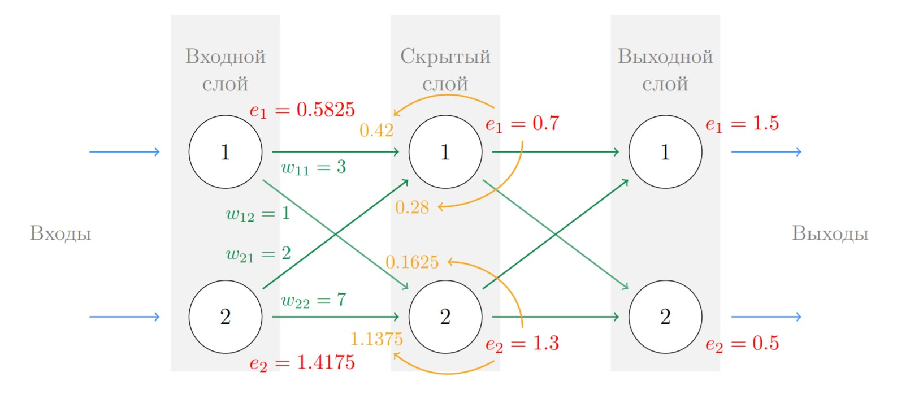

<gallery>
    
    
    
    
    
</gallery>

Перевод первой главы (80 страниц) замечательной книги Тарика Рашида "Создаем нейронную сеть", включая полную перерисовку всех изображений.
Некоторые места объяснены более подробно, чем в оригинале.
Продолжать не стал — вышел официальный перевод от издательства «Вильямс».

Качеством перевода я горжусь!
На момент написания я уже свободно владел английским. Ошибки встречаются относительно редко.
Больше нет впечатления, что перевод машинный, как было в случае моим [переводом](p:translation-level-up) книги "Level UP!".