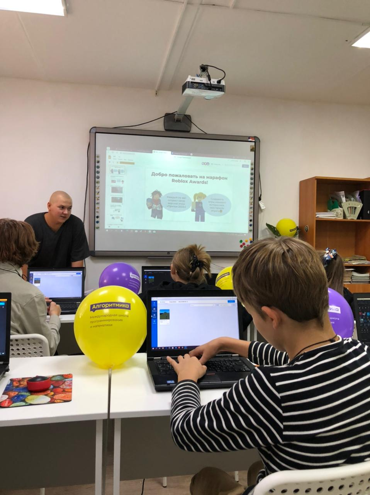
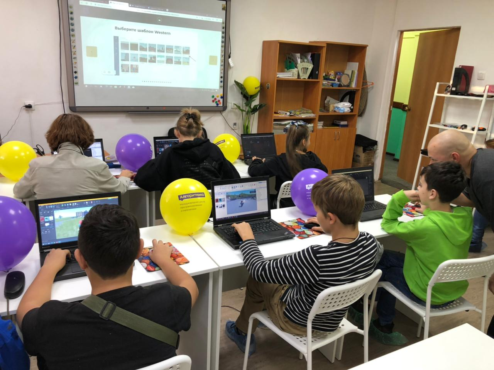
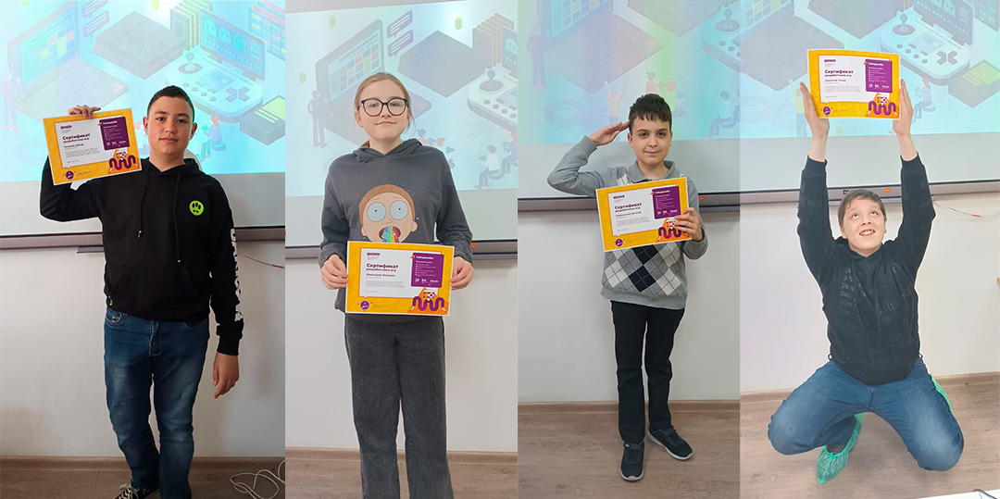
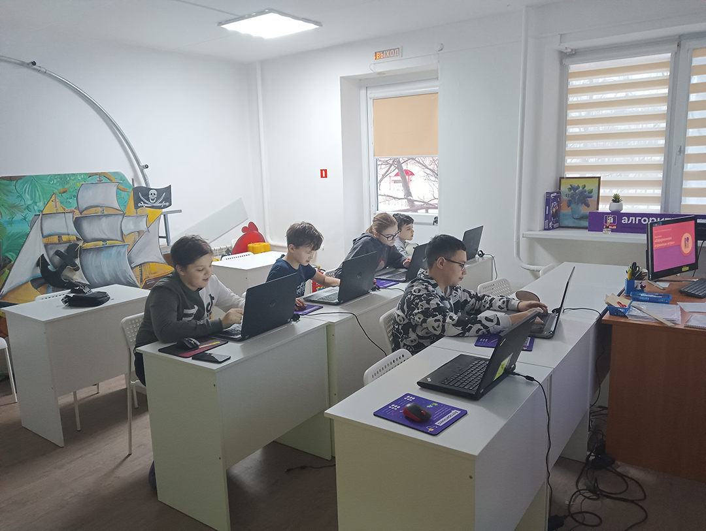
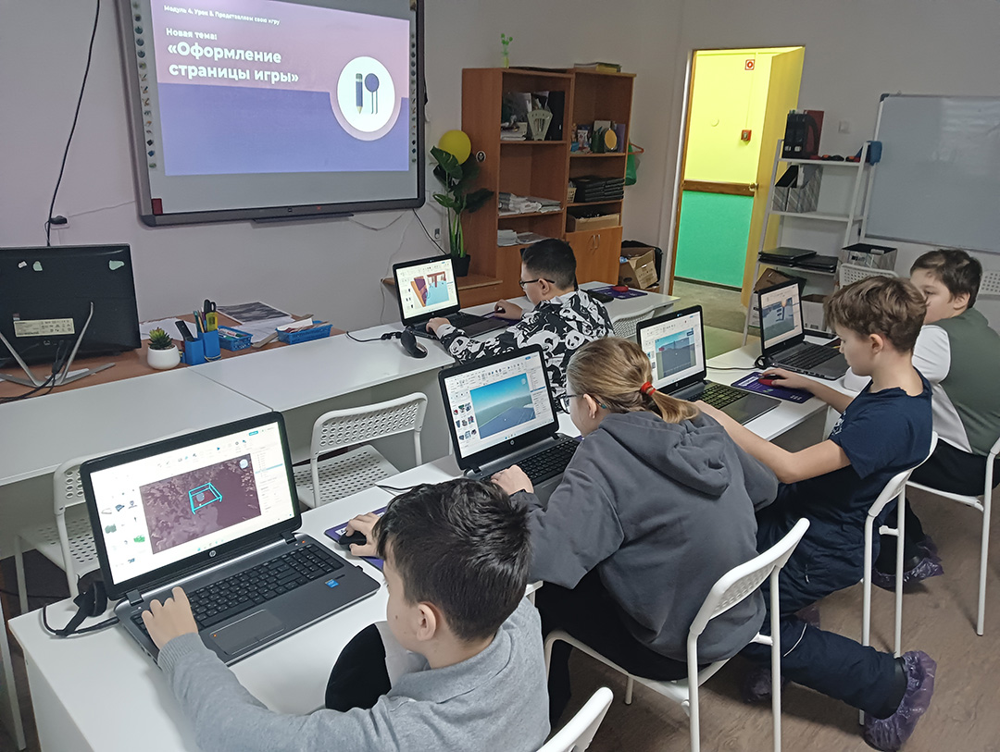
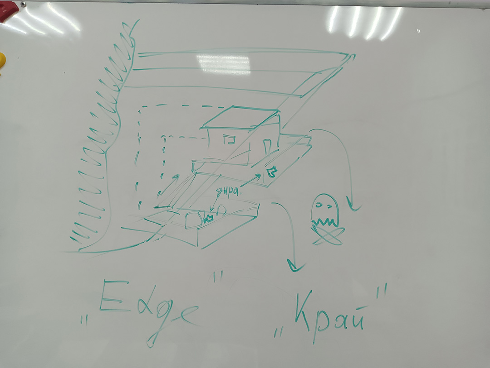
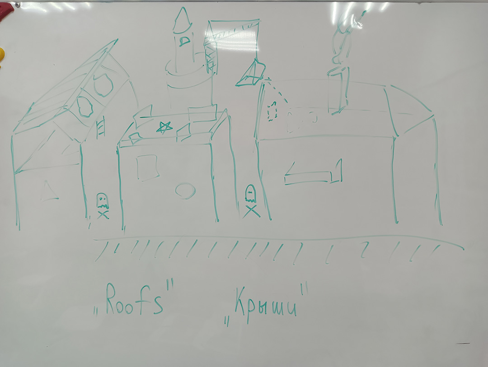
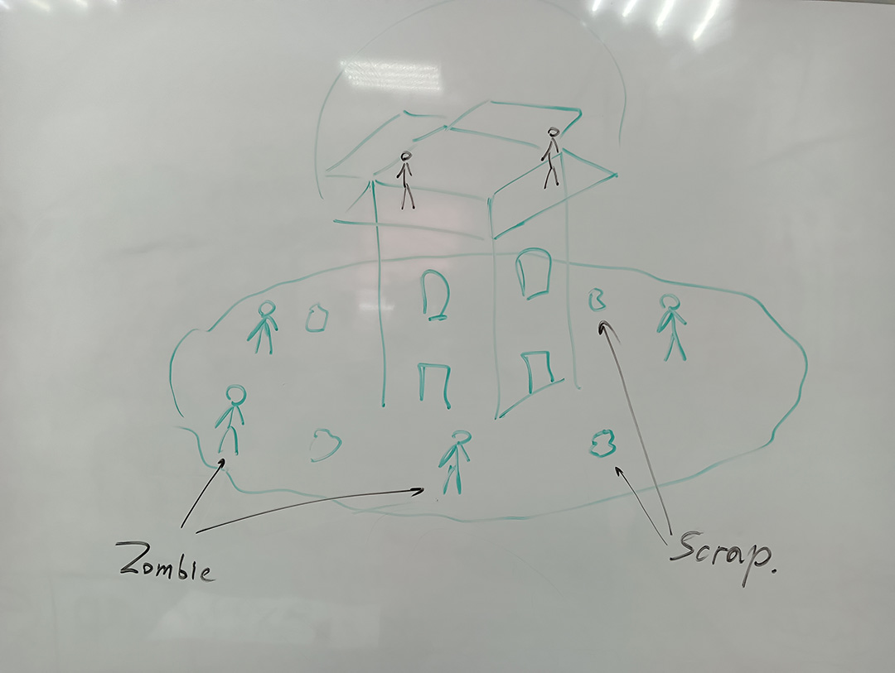
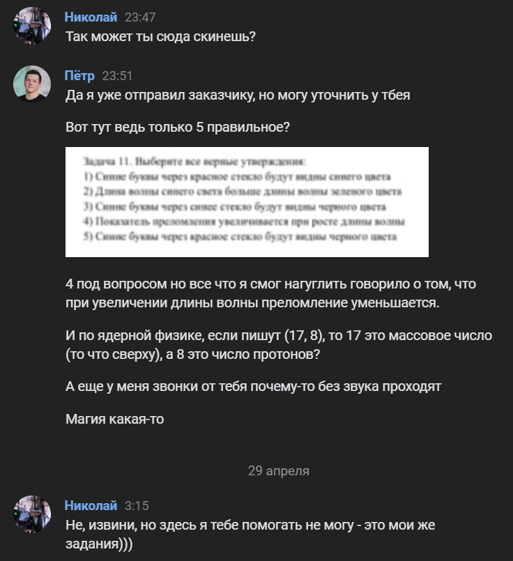

# Предыстория

Денег со своих проектов практически нет.
Родители говорят, что пора бы уже начать нормально зарабатывать.
Работа над [учебником](p:omath) идет медленно.
Такая непростая обстановка сложилась у меня в июне 2022 года.

Примерно тогда же мне позвонил Коля и сделал интересное предложение.
Я мог вернуться в Североморск, где он мог бы помогать мне с моим учебником.
А чтобы не сосать деньги из родителей, он может дать рекомендацию в крупнейший образовательный центр "Юный Умник".

Соглашаться не очень хотелось, но и не согласиться я не мог.
Надо было хоть раз в жизни поработать на настоящей работе.
Получить опыт в репетиторстве.
В итоге я принял решение хотя бы попробовать.

# (10 августа - 19 сентября 2022) Подготовка

Когда я сообщил Коле о своем решении, он дал мне контакты директора центра.
Она сообщила мне базовую информацию -- я буду задействован в двух основных направлениях: репетиторство и Алгоритмика.

Первое это обычная работа с учениками.
Кого-то нужно подготовить к экзаменам, кому-то просто подтянуть знания по предмету.
К такому типу работы я был более-менее готов.

А вот второе меня довольно сильно удивило.
Алгоритмика предоставляет готовые обучающие курсы вместе с личным кабинетом.
Преподавателю нужно лишь ознакомитсья с заранее заготовленным планом урока и провести его.
Ребята же выполняют задания прямо на сайте.

Однако, чтобы стать преподавателем в Алгоритмике, нужно пройти подготовку.
Так как я взял практически все возможные направления, тестов было много.
Они не очень сложные, но гуглить приходилось много.
Там же я узнал про замечательный визуальный язык программирования для детей под названием "Scratch".
Короче, почерпнул много полезной информации.

После прохождения тестирования пришлось записать небольшое видео, в котором я как-бы начинаю мастер-класс для ребят и их родителей.
Мы с отцом заморочились и даже подготовили небольшую презентацию специально для этого ролика.

<youtube video="GGFXPFu2Yok">

По идее, я должен был еще принять участвие в онлайн вебинаре, где нас бы просили в небольших постановочных ситуациях отработать навыки и правила общения с детьми и их родителями.
Я очень сильно волновался.
Но что-то у них там не срослось, поэтому в момент, когда сам вебинар должен был начаться, ничего не произошло, а всем на почту пришло письмо с ссылкой на запись такого же вебинара, но прошлого года.

# (25 сентября 2022) Мастер-класс по "Геймдизайну"

<gallery>
    
    
</gallery>

Один из самых волнительных моментов за весь период моей работы в центре.
7 ребят с родителями придут на мастер-класс, на котором я расскажу про себя и про курс.
Ничего подобного я в своей жизни еще не делал.
Очень волновался.

Но все прошло великолепно!
Дети и родители были довольны.
Директор центра сначала дала довольно долгую вступительную речь, поэтому мой выход был воспринят ребятами как глоток свежего воздуха.
Из 7 человек 6 записались на курс.

# (2 октября 2022 - 28 мая 2023) Алгоритмика

<gallery>
    
    
    
</gallery>

Основная группа собралась на курс "Геймдизайн".
Это дети в 6-7 классах.
Всего было 6 человек, из которых до конца добрались 5.
Я был немного разочарован, что мне не удалось вести курс по Python, который рассчитан уже на ребят из 9 класса.

Сначала мне удавалось следовать плану занятий, который составила Алгоритмика.
Но чем дальше, тем сложнее было это делать.
Проблема заключалась в том, что начиная с середины курса методисты запихнули кучу скриптов в занятия, хотя курс называется "Геймдизайн", а не "Программирование в Roblox".
Поэтому, чтобы не заставлять ребят заниматься скучной работой по копированию тонны непонятного кода, я либо искал уже готовые альтернативы в Toolbox или же вообще менял тему занятия на более творческую и креативную.

Все это дошло до того, что в последних месяцах я самостоятельно придумывал идеи для игр, а также свои темы для занятий.
Прямо приходил за пару часов в центр, садился в отдельном помещении, тестировал идеи и составлял план занятия.
Пару раз я проводил что-то вроде масштабных контрольных работ длительностью в пару занятий, на которых ребята самостоятельно продумывали идею мира, его фишки, а потом неспеша все это реализовывали.

<gallery>
    
    
    
</gallery>

Подобный "уход" от прописаного Алгоритмикой плана заставлял меня сильно тревожиться.
Если бы кто-то взглянул на статистику ребят через сайт Алгоритмики, то ужаснулся бы, словно мы вместо занятий все время сидим и чем-то другим занимаемся.
К счастью, директор заверила меня, что именно я оцениваю результаты ребят, а потому решения о выдаче сертификатов и прочего зависят от меня и нашего центра, а не указа "сверху".

К завершающему занятию надо было распечатать сертификаты на особой фотобумаге.
Пришлось научиться определять правильную сторону для печати.
Кстати, плотная бумага быстро закончилась и нам с администратором пришлось брать еще одну пачку за свои деньги.
Скинулись пополам.

После завершения курса каждому родителю я выслал небольшой отчет о проделанной работе (впечатления о ученике и его сильных сторонах, какие миры он создал за время курса, их скриншоты), а также рекомендации, на какие следующие курсы записаться.
Все родители были очень благодарны и довольны результатами.

## Такие разные ребята

Это был мой первый опыт работы с группой ребят.
У каждого свой характер и к каждому нужен свой ключик, свой подход.

Один быстро схватывает и прогрессирует, имеет творческую жилку.
Но при этом часто отвлекается и бесконечными разговорами может отвлекать других.

Второй, напротив, усваивает материал медленно.
Причем постепенно он "проваливается в себя" и если его не одергивать и не направлять, он просто начинает играть в своем мире, вместо того, чтобы его дальше развивать.

Третий тоже учится довольно быстро и может мыслить креативно, но сильно избалован и не может заставить себя собраться и создать (и уж тем более закончить) что-нибудь прекрасное.

Особого командного духа у нас не возникло.
Но я и не считаю, что он необходим.
Больше всего наши занятия походили на кружок по рисованию: дети приходят, работают над своими навыками и воплощают идеи в жизнь.

## Занятие по Python Start

С курсом "Python Start 2035" произошла интересная история.
Вроде как вести его должен был я, но почему-то в качестве преподавателя поставили другую женщину.
Но занималась она из-под моего аккаунта.

И вот однажды из Алгоритмики пришло указание заснять одно из занятий, чтобы убедиться, что оно проходит в соответствии с правилами и нормами.
А так как "на бумаге" этот курс вел я, то и занятие на камеру провести тоже сказали мне.

Господи, как же я кайфанул!
Дисциплину и порядок поддерживать не надо, ученики более-менее взрослые, тянутся к знаниям, с ними интересно общаться.
Очень жаль, что мне не досталось подобной группы на постоянной основе.

<youtube video="vWcpITaTMYI">

## Занятие по "Комьютерной грамотности"

Буквально в первый месяц работы перподаватель курса "Компьютерная грамотность" заболела и меня попросили ее подменить.
Пришлось согласился, хотя понимал, что будет очень тяжело.
Полтора часа пытаться обучить чему-то 10 детей 6-7 лет...

Занятие прошло неплохо, но от напряжения я аж вспотел.
Объясняешь что-то одним, другие начинают ерзать, общаться, а некоторые и носиться.
И так по кругу.
В итоге как уж на сковородке скачешь по аудитории.
Встречающие детей мамы смотрели на меня с сочувственной улыбкой.

После этого я попросил больше не давать мне группы с такими маленькими детьми.
Не могу я продуктивно с ними работать.
Да и не хочу.

# (3 октября - 31 мая 2023) Репетиторство

Всего за учебный год мне довелось поработать с 10 учениками, из которых до конца прозанимались 7.
Изначально я не хотел брать на себя математику 11 класса, но пришлось.
Впрочем, постепенно пришлось заниматься и физикой тоже.

## Смена парадигмы обучения

До Нового Года я всех учеников пытался обучать "фундаментально".
Подробное объяснение темы, вывод правил и свойств, погружение в детали.
Такой подход работал с учениками, у которых на носу не было экзаменов.

Однако за пару месяцев стало понятно, что для 9- и 11-классников такой подход неприменим.
Им не нравится математика.
Им нужно просто как-то ее сдать, без вникания в подробности.
Движемся слишком медленно.

Неудовлетворительные результаты меня очень угнетали.
Пик негатива пришелся на Новый Год, когда одна ученица из 11 класса ушла к другому репетитору.
Расстались мы на позитиве, конечно же, но внутри я понимал, что одна из причин ухода -- медленное продвижение вперед.

В отчаянии и смятении я обратился с советом к Коле.
Он помог мне перейти от "фундаментального" обучения к "алгоритмическому".
Помог принять мысль, что таким ученикам математика не нужна, им нужны быстрые и понятные алгоритмы, как решать задачи на экзамене.
Более того, мы совместно составили примерный план подготовки для каждого из учеников.

После такой совместной работы я успокоился в душе.
Появилась уверенность, что все более-менее получится.
Он спас меня в тот день.
И за это я ему очень благодарен.

## Впечатления от учеников

Ученики были самыми разными, полный спектр.
Именно опыт взаимодействия с разными учениками я считаю одним из самых ценных результатов этой поездки на север.

Были способные, замотивированные.
С такими работать одно удовольствие, потому что им не только алгоритмы даешь, но и подробно все объясняешь.
Плюс, можно делиться всякими фишками.
Задачи с ними решаешь более трудные, потому и сам что-то новое узнаешь.

Но были и полные противоположности.
Невероятно ленивые, вечно невыспавшиеся, никогда не делающие домашнее задание.
Ты им даешь знания, а они прямо на глазах вываливаются у них из головы.
Иногда хочется взять и что-нибудь раздолбать от ощущения бессилия перед ленью.
Пару раз даже приходилось повышать голос и жестко настраивать на работу, хотя я и не люблю конфронтации.

Причем при работе с "плохими" учениками ты понимаешь, что им насрать на экзамен, на результат.
Не насрать только мне и родителям.
И вот так мы совместными усилиями пытаемся вытащить бегемота из болота.

## Не все зависит от тебя

Очень много стресса добавлял фактор ответственности.
Ведь это мой ученик, и только от меня зависит, сколько баллов он получит на экзамене.
Дополнительно стресс подкреплялся синдромом самозванца, так как это был мой первый опыт работы в качестве репетитора.

К счастью, мне удалось частично справиться с этой проблемой под конец учебного года.
А получилось это потому что у меня появились ученики, которые начали получать неплохие, а иногда и отличные результаты.

Пришло понимание, что не все зависит от тебя.
Хоть ты в лепешку расшибись, но для продуктивной работы и хорошего результата нужна работа как со стороны репетитора, так и со стороны ученика.

## Обновление знаний

За этот учебный год я очень сильно качнул школьную математику.
Я полностью отработал ОГЭ и практически полностью профильное ЕГЭ, за исключением некоторых задач из второй части.

Очень классно, что я наконец освоил основы геометрии, потому что в ней я сильно плавал.
Ну и полезно было вспомнить физику 7 класса: силу Архимеда, рычаги, блоки и энергию.
С системами блоков возникли трудности, поэтому даже пришлось подключать Колю.
Он тоже объяснил не очень понятно и довольно скоро при самостоятельных попытках все осмыслить ко мне пришло реально клевое объяснение всех этих законов.

## Результаты учеников

Сильный ученик по ОГЭ, скоторым мы начали готовиться буквально за полтора месяца до экзамена, получил 5 (24 балла из 31).
Слабая ученика по базовому ЕГЭ усердно трудилась, делала и ДЗ по итогу из первоначальной двойки вытянула на 4.
Отличный результат.
Кстати, именно этот результат окончательно убедил меня, что не все зависит от меня.
Важно, чтобы ученик тоже проявлял активность и ответственно относился к делу.

Крутого семиклассника вытянул на пятерки по алгебре, геометрии и физике.
С ленивым семиклассником все было гораздо труднее, но я сделал так, чтобы основые формулы и знания в голове у него остались.

Одному из слабых учеников по ОГЭ не хватила одного балла.
А второй вообще на связь не выходил.
С ученицей по профильному ЕГЭ так же ситуация, про результат свой она не написала.

# (28 апреля 2023) Домашнее задание от Николая

Связалась со мной адмнистратор и сообщила, что есть возможность быстро подзаработать -- решить 15 задач по физике 9 класса.
Я хотел сначала отказаться, но потом пересилил себя и согласился.
Да и денег под конец месяца не было.

Через пару дней позвонила мама ученицы и сообщила, что им хотелось бы получить 4 по физике в году.
А для этого нужно хорошо сделать большое домашнее задание, которое учитель выдает сразу на триместр вперед.

Она прислала мне задачи, я на них мельком глянул и сдуру назвал цену в 800 рублей, да еще и сказал, что сделаю все за вечер.
Это были самые тяжелые 800 рублей в моей жизни...

Некоторые задачи были довольно простые, но проблема заключалась в том, что я эти темы совершенно не помнил.
Поэтому в срочном порядке пришлось вспоминать оптику, волны и ядерную физику.
Но были и довольно хитрые задачи, которые очень плохо гуглились.

Короче, начал я их решать в 19:10, а завершил в 23:43.
Почти 5 часов напряженной работы.
За 800 рублей.

Уже после отправки работы я решил на всякий случай проконсультироваться по паре вопросов у Коли.
И какого же было мое удивление, когда он мне сообщил, что он и есть тот самый школьный учитель, который выдал это ДЗ!
Вот уж действительно мир тесен!
В угоду спортивному интересу он отказался помогать мне с задачами до выставления финальной оценки.

{: .w5 }

Уже после выставления оценком мы с ним встретились, чтобы обсудить результаты.
Я получил 5/5/4.
Причем, если бы не совершенные мной ошибки, ученица уже автоматом получила бы 4.
Дальше на протяжении полутора часов я как лев сражался, пытаясь выбить хотя бы по полбалла из каждой ошибки.
Это было прекрасно.
Спорили, как в [старые добрые](p:severomorsk).

Свою четверку ученика все же получила, вроде.
Но это неточно.

# Общие впечатления

Впервые в жизни я работаю по строгому графику, взаимодействую с коллегами, согласовываю расписание, поддерживаю контакт с родителями, проверяю и выдаю домашние задания.

Это очень ценный опыт.
Были как негативные моменты, так и положительные.
Последних гораздо больше.
Вообще, мне очень сильно повезло.
Коллеги дружелюбные, готовы помочь, скандалов никаких не было.
Идеальный опыт первой работы.

Однако, как и в случае с университетом, под конец учебного года приходит понимание, что надо срочно развивать свои проекты, чтобы каждый год не ходить кругами и не повторять одно и то же.

Все мое пребывание на севере можно разбить на 4 больших этапа: знакомство, угасание, возрождение, завершение.
Все они сильно отличаются друг от друга по общему состоянию.

## Знакомство

Очень волнительный период.
Я полон сил, энергичен, все в новинку.
Ходил в бассейн, обустраивался в квартире, привыкал к работе в центре, знакомился с учениками.
Постепенно эффект новизны пропадал и я стал костенеть, угасать.

## Угасание

Время шло, приближался Новый Год.
Забросил ходить в бассейн.
Опять начал играть в доту.
А я все не мог заставить себя хотя бы начать работать над [учебником](p:omath).

Чем дальше, тем хуже мне становилось.
Накапливался стресс от ощущения, что я не могу хорошо подготовить учеников, что мы не успеем.
Сам на себя злился, из-за того, что не работал над учебником.

У меня настолько не было внутренних сил что-то делать, что я начал целыми сутками смотреть страшные истории на YouTube.
Были среди них и простенькие, а были и настоящие шедевры, после которых страшно было засыпать.

Легко догадаться, что десятки страшных и депрессивных историй еще сильнее угнетают психику.
Кульминацией стал момент, когда я чуть с ума не сошел, боялся по квартире ходить, в подъезд выходить.
Короче, я опустился на самое донное дно.

## Возрождение

За неделю до Нового Года мне все же удалось собраться и взяться за дело.
К Новому Году выложил первую рабочую версию учебника, весь январь переносил статьи из старых учебников, писал новые, исправлял баги, вновь записался в бассейн.
Это был самый продуктивный месяц за весь учебный год.
Я был страшно доволен собой.

## Завершение

Январь кончился, а вместе с ним кончился и заряд "супер-продуктивности".
Постепенно начинался нервный и неспокойный предэкзаменный период.
Количество занятий в центре увеличилось.
В итоге после работы у меня просто не оставалось внутренних сил делать хоть что-то еще.

# Конпенсация общения

Я всегда считал себя человеком довольно нелюдимым, избегающим общения.
Так и есть, но вот сутками сидеть в пустой квартире тоже тяжело.
Спасение пришло с неожиданной стороны -- недостаток общения и внимания я восполнял, участвуя в бесконечных дискуссиях на DTF.

Никогда бы не подумал, что мне проще будет сидеть и общаться в комментах, чем играть в какую-нибудь игру...
Возможно, именно DTF помог мне окончательно не сойти с ума в период "Угасания".

# Плотоядные голуби

У меня под окном с внешней стороны в стене есть отверстие.
И там жили голуби.
Зимой из-за холода они пытались проклевать себе путь ближе к моей квартире.
Все это довольно жутко и громко звучало, будило по ночам.

В какие-то моменты мне казалось, что еще чуть-чуть и они прогрызутся внутрь.
К счастью, в стене, видимо, была какая-то перегородка, через которую они не могли пробиться.

Чего я только не слышал: рождение птенцов, прилеты и отлеты их родителей, трапезы.
Один раз судя по звукам там вообще кого-то сожрали (может, ворона прилетела).

В конце концов я настолько привык к этим звукам, что перестал их замечать.
А ближе к лету на улице стало сильно теплее и звуки заметно поубавились.