<gallery>
    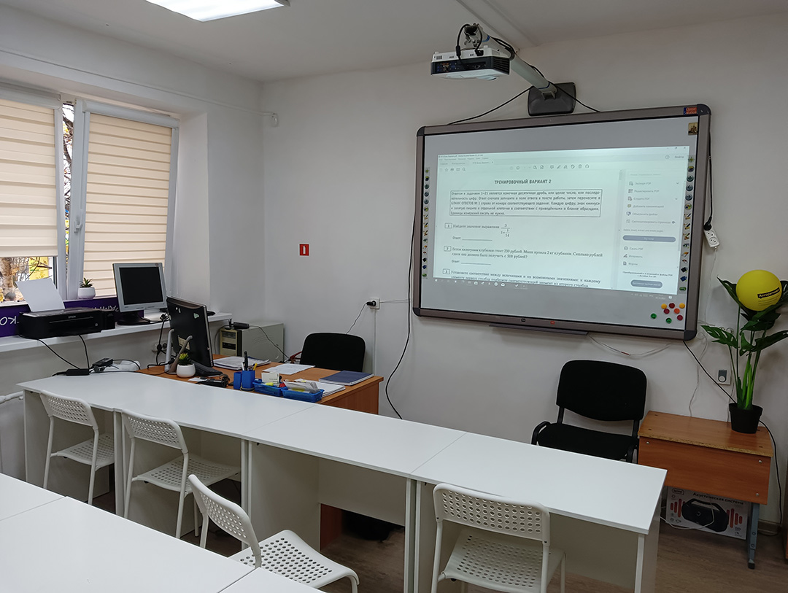
    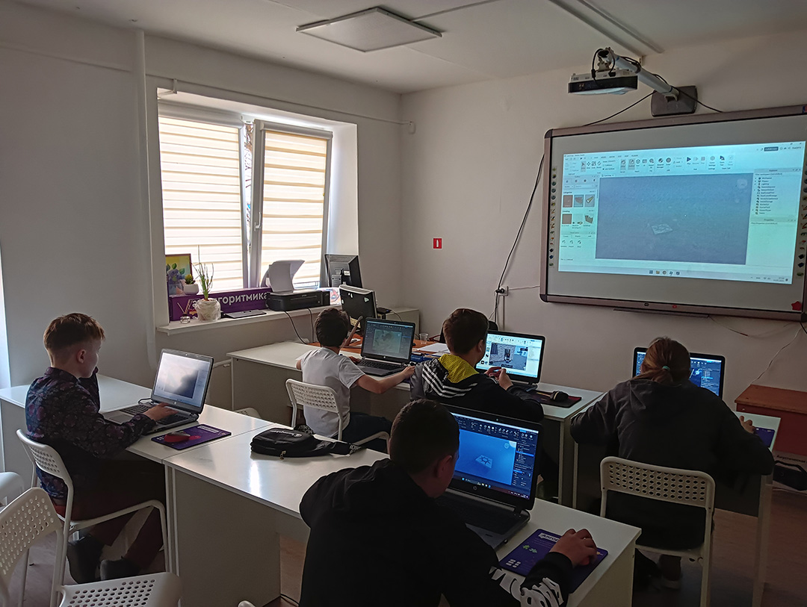
    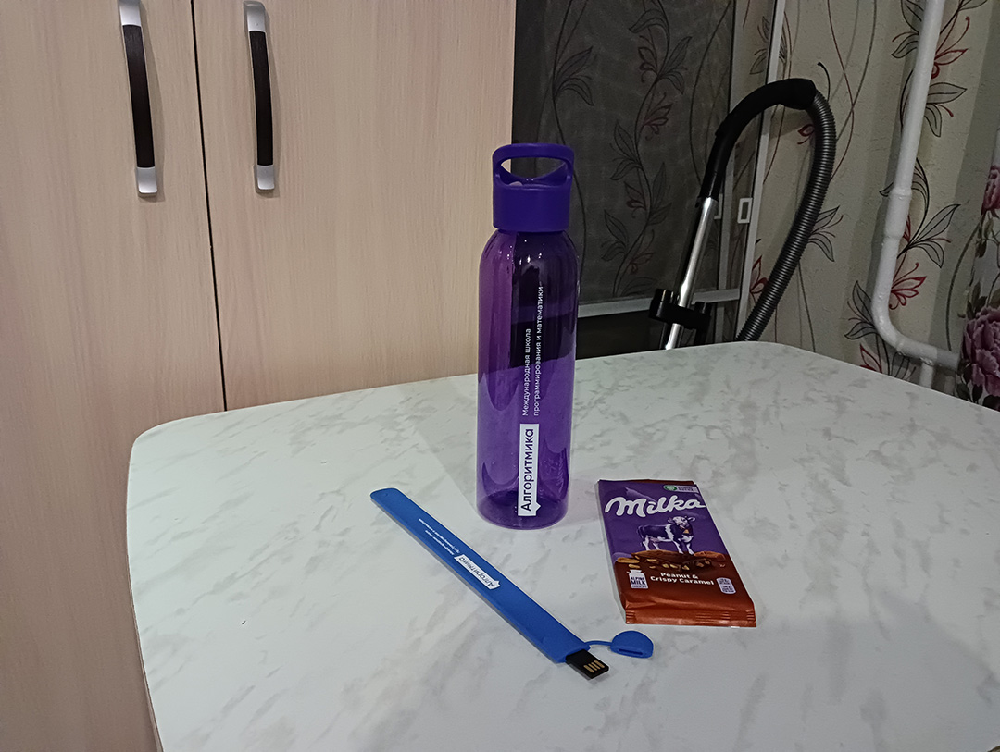
    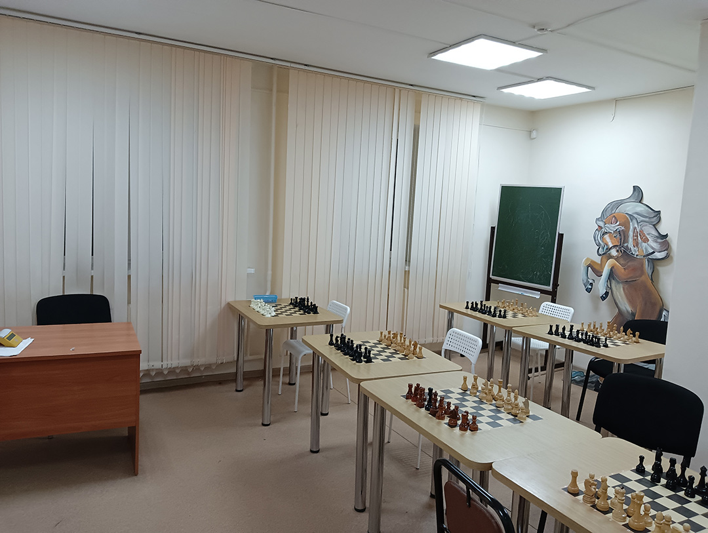
    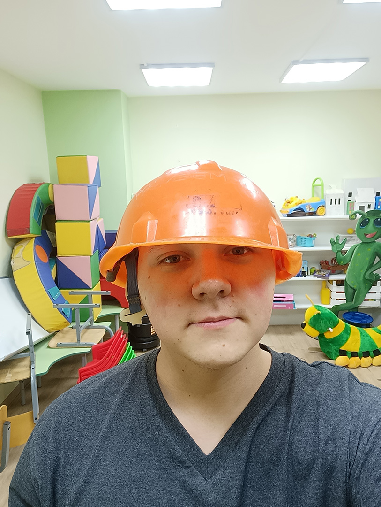
    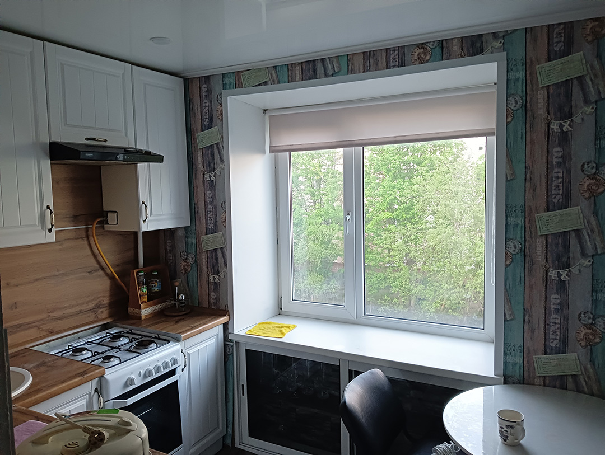
    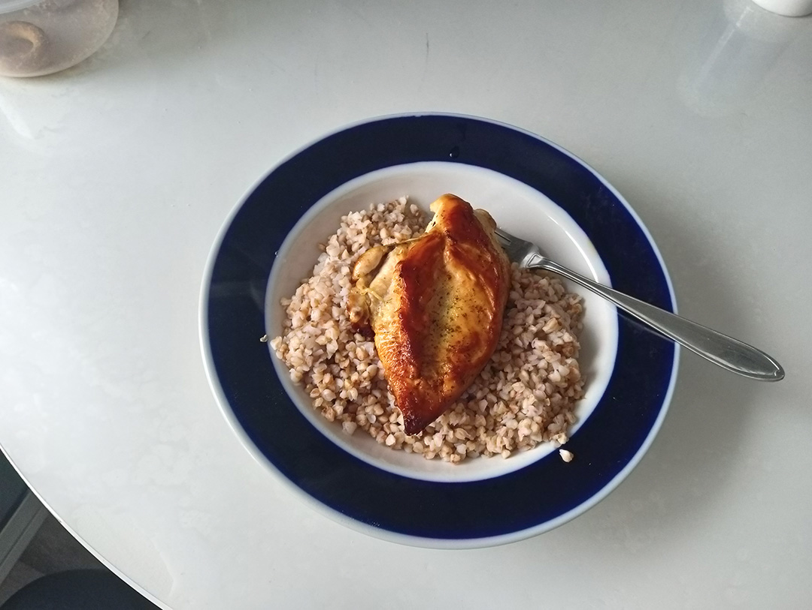
    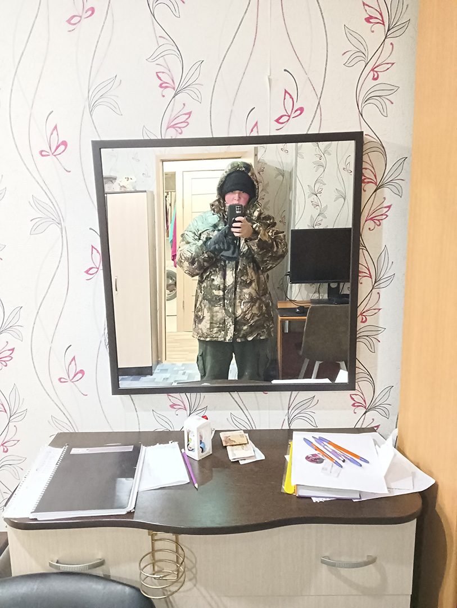
    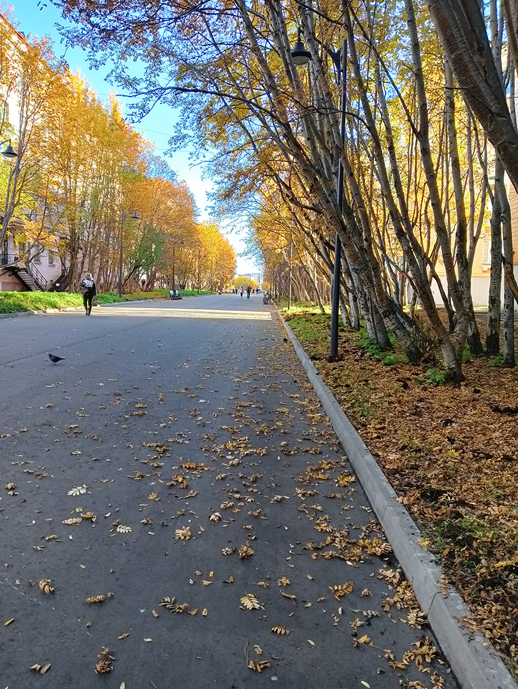
    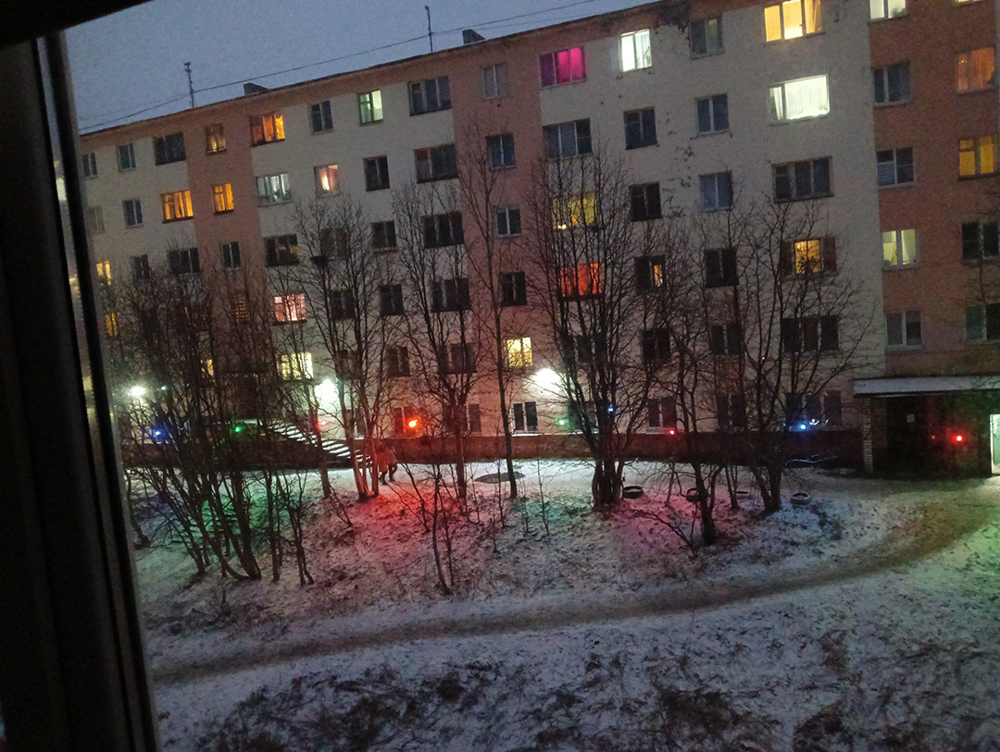
    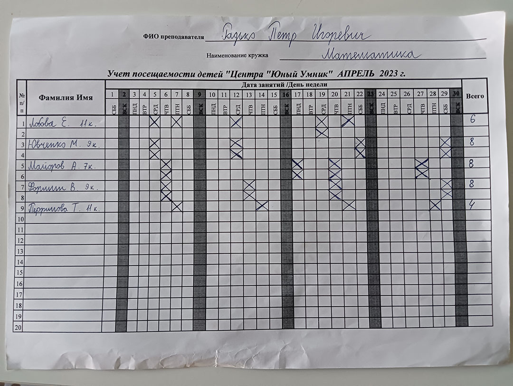
    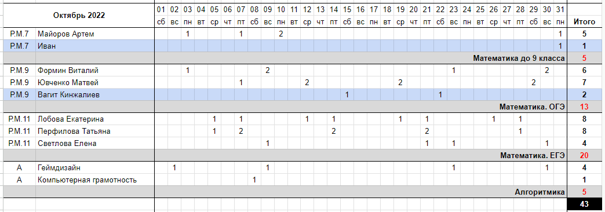
</gallery>

Проекты приносят мало денег, родители наседают.
Ситуация тяжелая.
Выход предложил Коля -- вновь отправиться на далекий север для того, чтобы завершить [учебник](p:omath), а заодно и устроиться на свою первую работу в местный образовательный центр.

Первая официальная работа, первый опыт в репетиторстве, первый опыт работы с группой, первый опыт проживания на собственные деньги.
Это был уникальный учебный год, наполненный впечатлениями, новым опытом, радостями и страданиями.