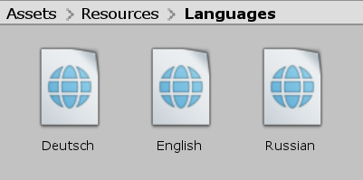
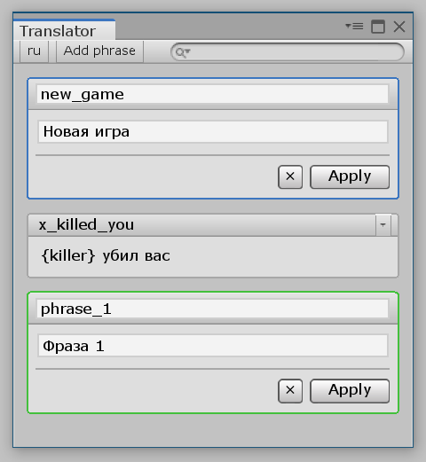
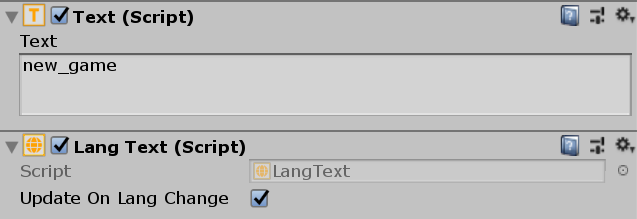

<gallery>
    
    
    
</gallery>

Во время разработки ["Крестиков Ноликов 3D"](p:tictactoe3d) потребовалось добавить поддержку нескольких языков.
Чтобы для других игр не писать каждый раз одно и тоже, решил оформить код в виде своего первого Unity пакета.

С помощью пакета можно создавать языковые файлы, с помощью специального редактора заполнять их фразами, получать текст фраз на нужном языке в игре по их идентификатору.