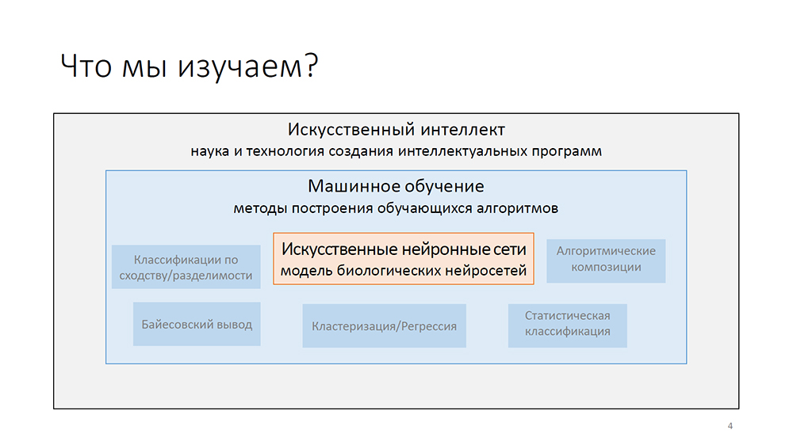

<gallery>
    
    
    
</gallery>

В апреле 2016 года со мной связалась менеджер по подбору персонала
образовательной платформы [GeekBrains](https://gb.ru/) и предложила работу преподавателя в их школе.
В качестве вступительного испытания нужно было выбрать какую-нибудь IT тему и провести по ней вебинар.

Мы с отцом решили, что надо рассказать про нейронные сети.
Через 10 дней подготовки я провел свой первый в жизни вебинар. Было очень волнительно, но все прошло замечательно.
Записалось около 500 человек, а реально участвовало около 100. Презентация шла час, никто не ушел. Затем еще час ответов на вопросы. Многие в комментариях писали, что тема нейронных сетей их очень заинтересовала.

На фоне такого успеха мы предложили GeekBrains создать отдельный курс по нейронным сетям за моим авторством.
Они отказались, а мне идея раз за разом проводить одинаковые курсы не очень нравилась.
На этом наши пути разошлись.