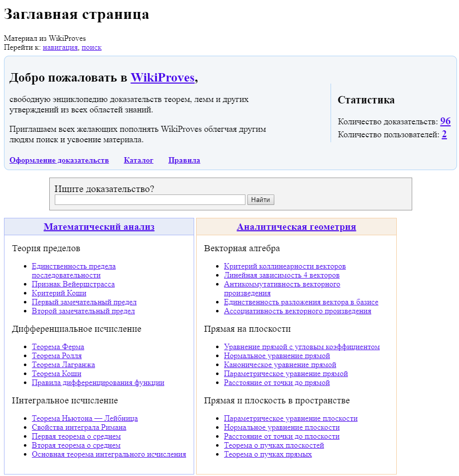

<gallery>
    
    
</gallery>

В ВУЗе меня просто завалили огромным количеством теорем и лемм.
Доказательства каждый раз приходилось искать либо в учебниках, либо в интернете.
Решил создать свободную энциклопедию на движке Википедии со всеми теоремами, леммами и утверждениями с максимально простыми и наглядными доказательствами.

Всего доказал 96 разных теорем из разных разделов математики. Доказательства были разные: от самых простых в пару строчек, до целых рассказов в пару листов бумаги размером.

В определенный момент создал канал на YouTube для видеороликов с доказательством.
Это не только увеличило бы популярность сайта, но и сам материал я запоминал бы еще лучше.
Снял только один ролик.

В какой-то момент из-за отсутствия денег забил на напоминания о необходимости продлить хостинг.
Я не помню, что именно случилось, но все файлы сайта оказались удалены. Либо их удалил хостинг за неуплату, либо я сам.
Очень жаль, ведь там было много ценной информации.