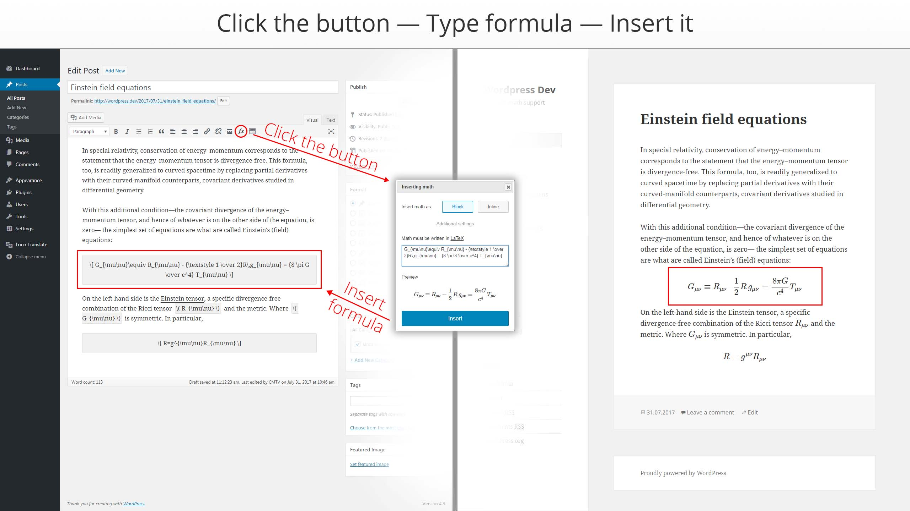
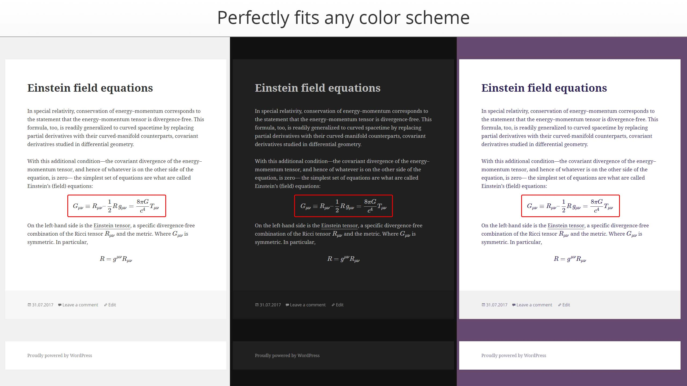
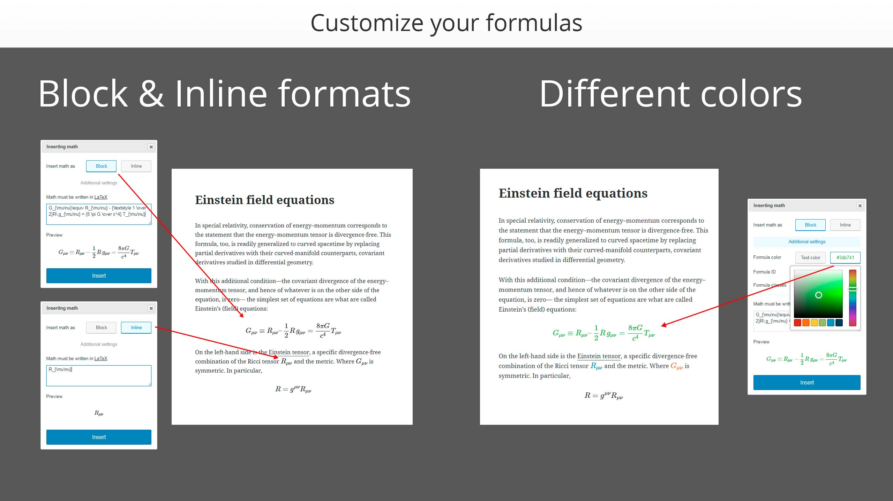

<gallery>
    
    
    
</gallery>

Мой первый плагин для Wordpress, отображающий красивую математику на сайте, а также позволяющий удобно вставлять ее в админ-панели.
Формулы можно вставлять через удобное окошко с предпросмотром, менять их цвет, указывать идентификатор и класс.

На сайте формулы отображаются красивыми шрифтами, их цвет совпадает с цветом обычного текста, они отлично масшатбируются, а при сужении окна браузера к ним добавляются полосы прокрутки.