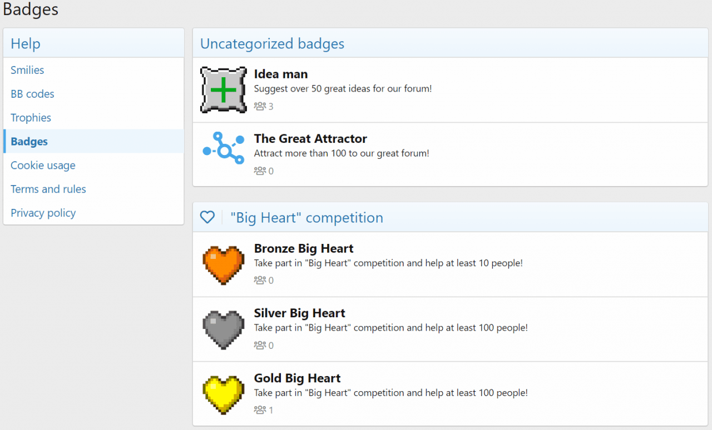
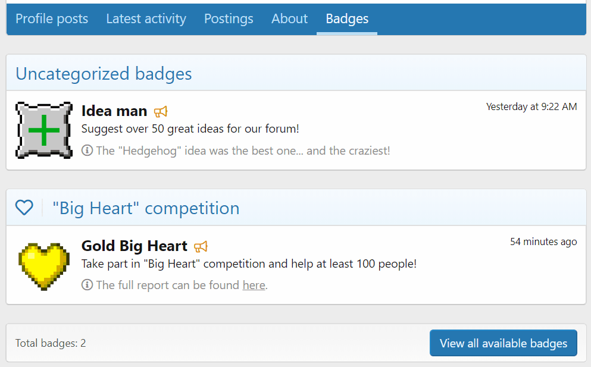
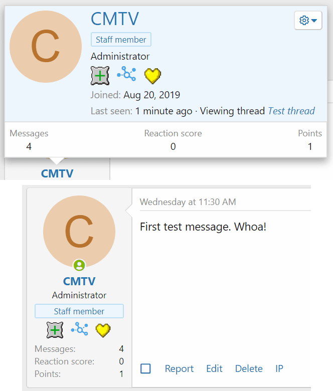
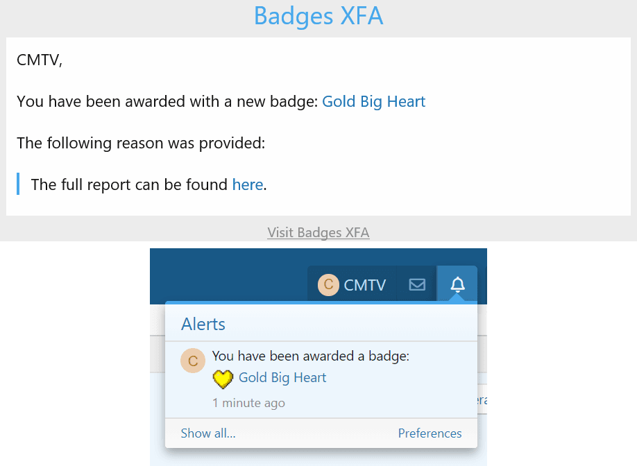
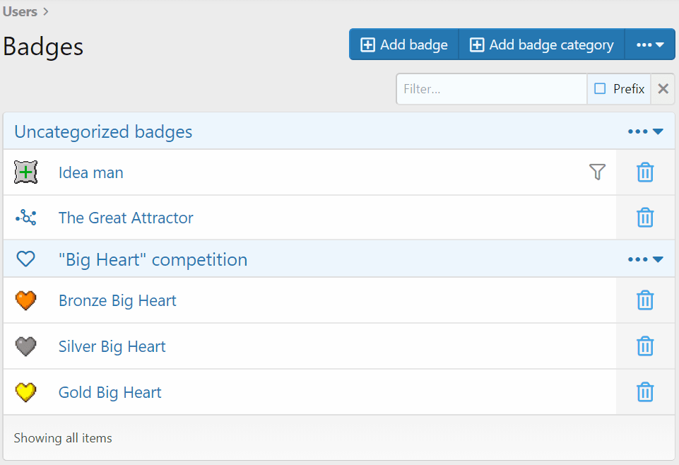
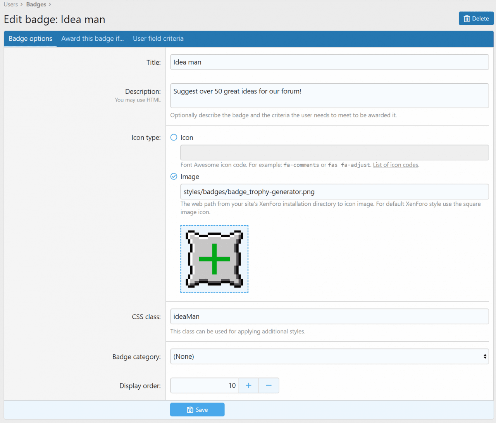

<gallery>
    
    
    
    
    
    
    
    
</gallery>

В XenForo есть система "достижений". С ее помощью можно награждать пользователей за всякие полезные действия. Но достижения обычны и скучны. Так или иначе, любой может их получить. ☹️

Медали — совсем другое дело! Медалями можно по-настоящему гордиться!

Аддон Badges добавляет на форум возможность создавать красивые медали, объединять их в категории и вручать их пользователям за ценные и уникальные действия!
Сами пользователи могут выбрать выставить напоказ несколько своих самых любимых медалей.