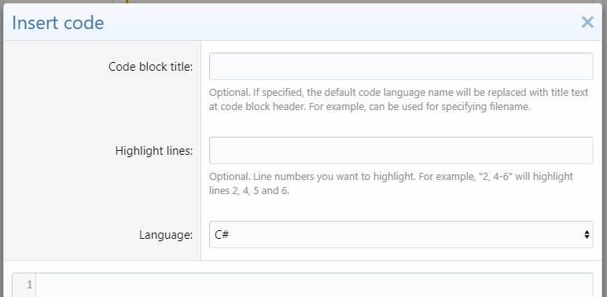

<gallery>
    
    
    
    
    
    
</gallery>

Стандартные блоки кода в XenForo неудобные: нет номеров и подсветки строк, нельзя настроить распространенные языки для быстрой вставки, высота блока ничем не ограничена, нельзя указать название блока и еще ряд других проблем.

На форуме проекта [MC Modding](p:mcmodding) эти проблемы были недопустимы, поэтому я написал аддон, который кардинально улучшил функционал по отображению программного кода XenForo:

* Быстрый выбор избранных языков программирования на форуме.
* Блокам кода можно добавлять заголовки.
* Большой код ограничен по высоте, его можно разворачивать и сворачивать, произвольно менять высоту, копировать в буфер обмена.
* Все строки кода пронумерованы, а самые важные можно подсвечивать.
* Возможность дополнительной стилизации блоков кода.