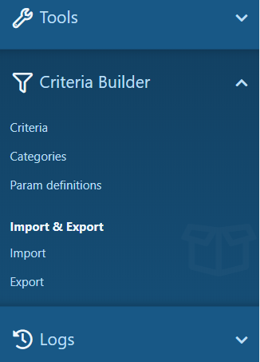
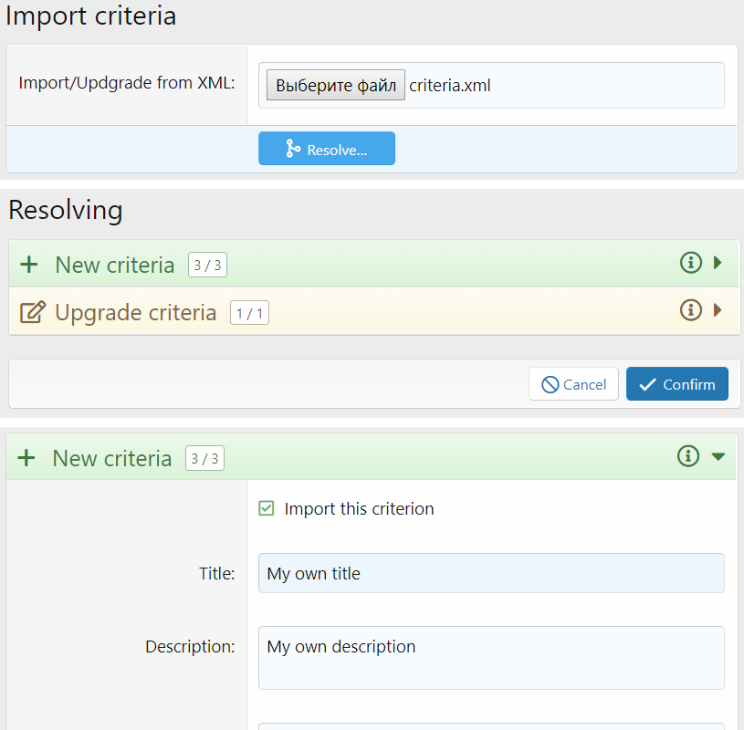
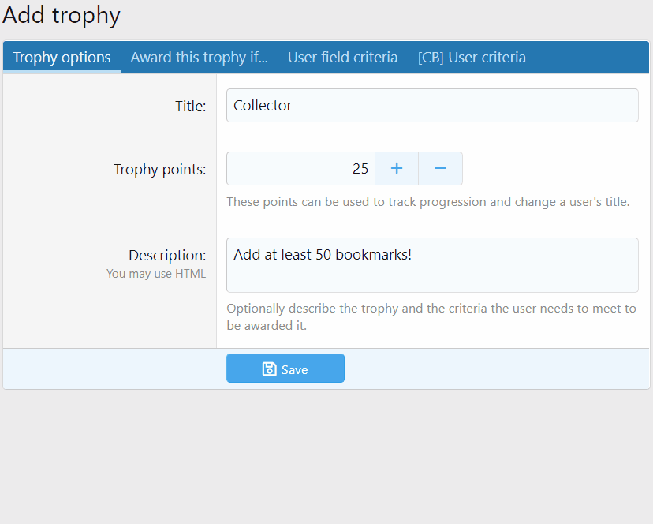
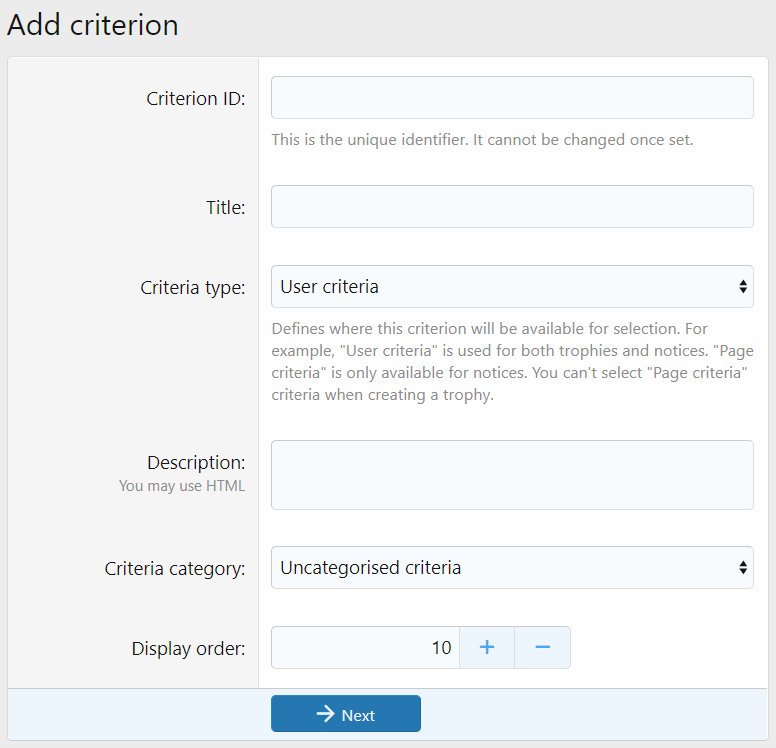
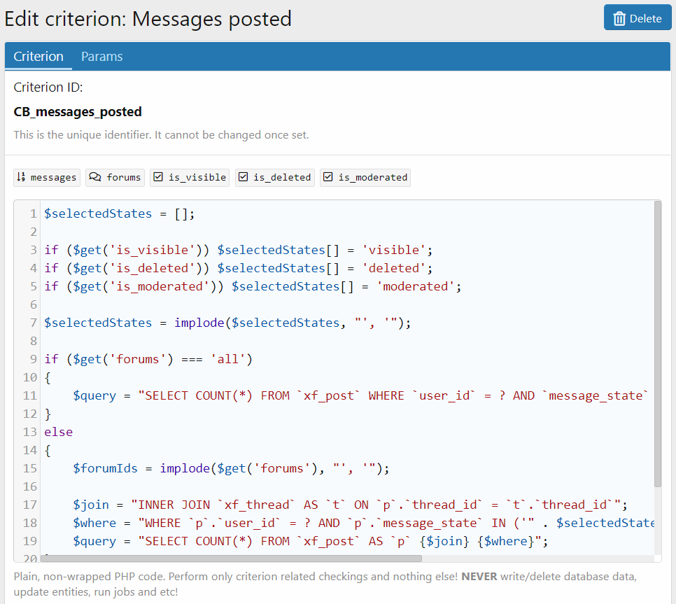
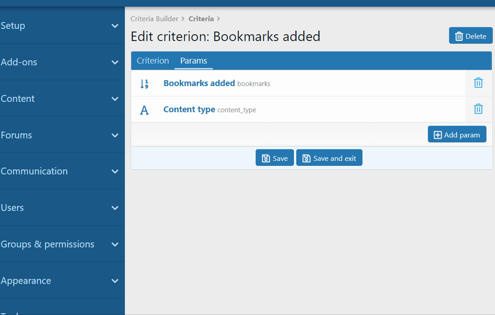
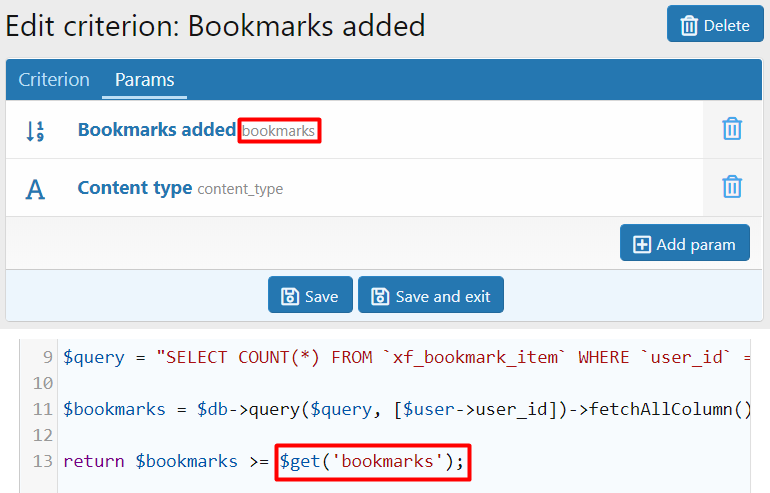
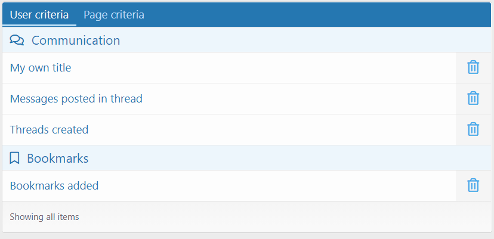

<gallery>
    
    
    
    
    
    
    
    
    
</gallery>

В XenForo для выдачи достижений, повышения прав пользователей, показа баннеров и прочего используется система готовых критериев. Для простых задач их хватает, но сложные условия с их помощью составить нельзя.

Первой попыткой решить эту проблему был аддон [PHP Criteria](p:xf-php-criteria).
Со своей задачей он справлялся, но пользоваться им могли только PHP программисты, более-менее разбирающиеся в ядре XenForo.

Через год я решил вернутся к этой теме, но уже с большим опытом разработки аддонов за плечами.
Аддон планировал сделать платным, поэтому во время разработки выкладывался на максимум.
Получился самый комплексный и крутой аддон в моей карьере XenForo программиста.

В нем есть абсолютно все для работы с критериями:

* Полный контроль из админ-панели, без необходимости создавать файлы на хостинге.
* Возможность импорта/экспорта/обновления критериев.
* Редактирование критериев прямо в браузере.
* Динамические параметы, добавляющие гибкости к критериям.
* Drag-and-drop сортировка критериев.
* Другие программисты могут добавлять свои параметры и даже типы критериев.
* Criteria Builder автоматически подключается к аддонам, которые используют систему критериев.
