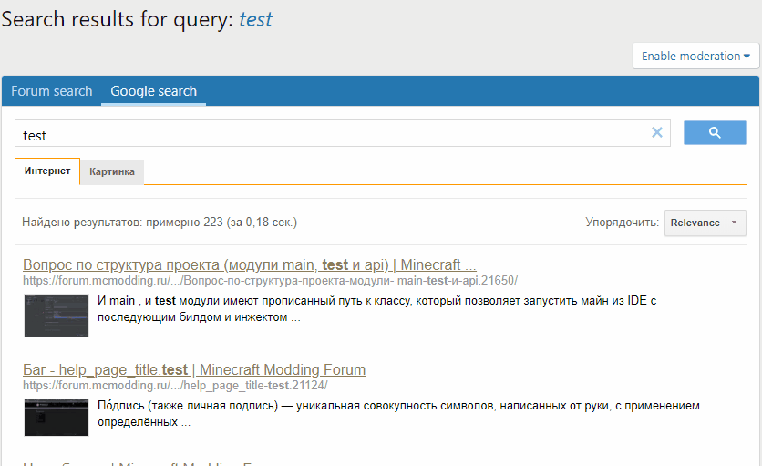
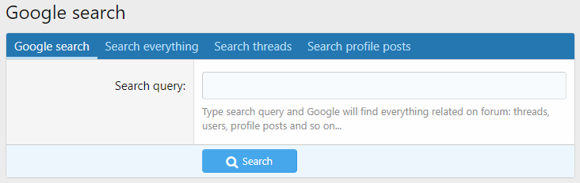
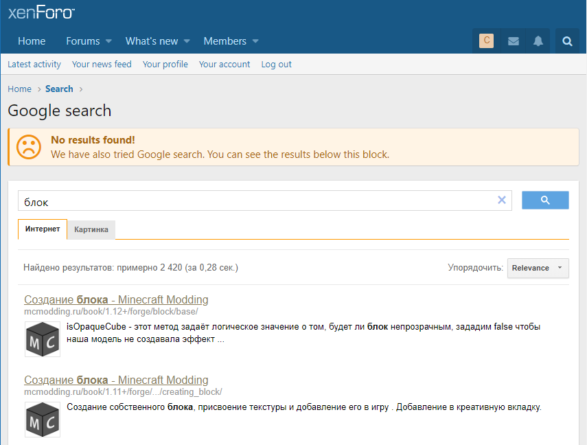

<gallery>
    
    
    
    
    
</gallery>

Поиск XenForo не работает для коротких (3 буквы и меньше) запросов, не ищет по картинкам и имеет другие ограничения.
Есть, конечно официальный аддон Enhanced Search, но он требует наличия определенного ПО на сервере.

Форум проекта [MC Modding](p:mcmodding) этим требованиям не отвечал.
Для решения проблем с поиском я создал аддон, который позволяет пользователям использовать Google поиск прямо внутри форума.

Кроме того, реализовал режим "Последний шанс", когда Google поиск производится автоматически, если сам форум ничего не нашел, или вообще не сумел произвести поиск.