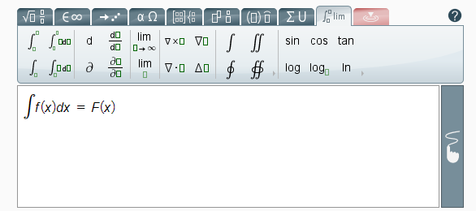

# Первая версия

К своим проектам по математике я хотел добавить форумы.
Встроенной поддержки математики у XenForo не было, поэтому я решил написать аддон, который ее добавляет.

В первой версии для отображения математики использовался движок [MathJax](https://www.mathjax.org/), как и в моем аналогичном [плагине](p:wp-insert-math) для Wordpress.
У него мощный функционал, но имеются и большие проблемы. Сама библиотека много весит, а также ей требуется время, чтобы преобразовать
LaTeX в красивую математику.

Позднее я добавил поддержку визуального редактора формул [MathType](https://www.wiris.com/en/mathtype/).
Возможность писать формулы на чистом LaTeX осталась.

# Вторая версия

Добавил поддержку XenForo 2.1, исправил множество багов, добавил более удобные настройки.
Визуальный редактор MathType пришлось убрать из аддона, так как оказалось, что он для работы требует покупки лицензии.

# Третья версия

Перешел с MathJax на [KaTeX](https://katex.org/), который значительно меньше весит и гораздо бысрее отображает математику.
Более того, он поддерживает автоматичесское разбиение больших формул на части при изменении
размеров окна браузера.

Добавил поддержку XenForo 2.2, отдельную страницу в админ панели для детальной настройки аддона.
Появилась возможность создавать макросы и указывать собственные символы для обозначения строчных и блочных формул.