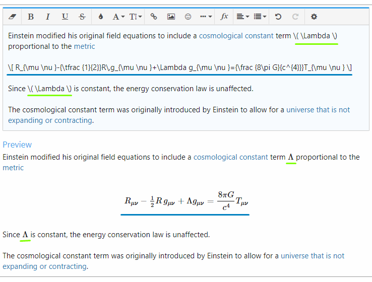
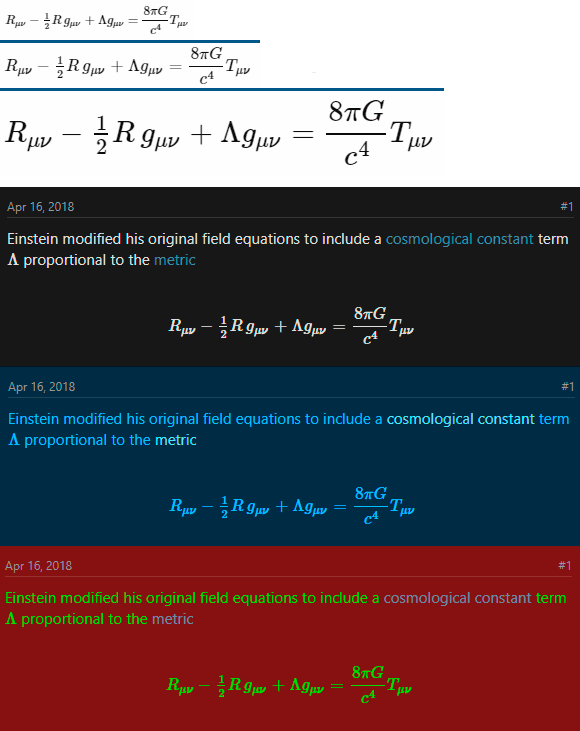
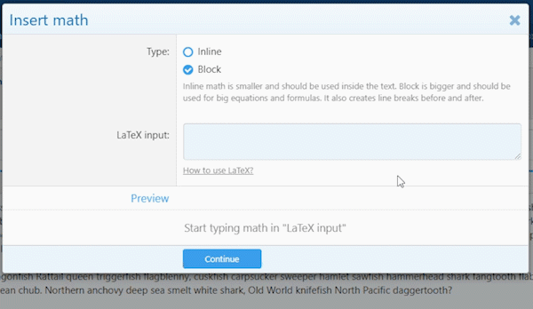
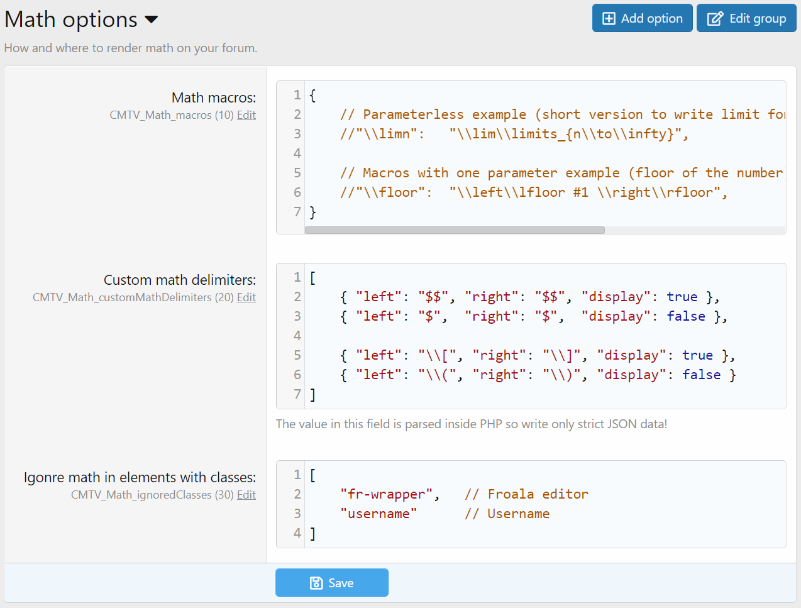

<gallery>
    
    
    
    
    
    
    
</gallery>

XenForo аддон, превращающий LaTeX код на форуме в красивые, четкие и масштабируемые математические формулы!
Он также добавляет кнопку "Вставить математику" в текстовый редактор. Она очень сильно упрощает процесс добавления математики в сообщения, темы и на другие страница форума.