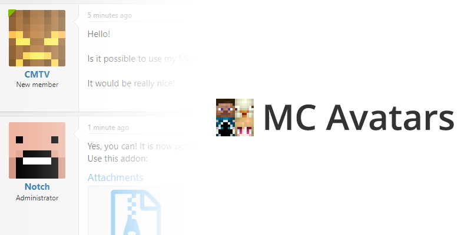
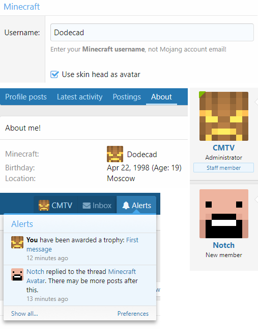

<gallery>
    
    
</gallery>

Мой самый первый XenForo аддон. Сделал я его специально для своего форума в рамках проекта [MC Modding](p:mcmodding).
Он позволяет указать свой ник в Minecraft, а также использовать голову скина в качестве аватары на форуме.

Аддон работал очень нестабильно. Для нормальной работы требовалось устанавливать
связь с сервервами Mojang,  получать всякие токены, кешировать скины и прочее в таком роде.
Моих технических знаний не хватало, чтобы все это грамотно реализовать, поэтому этот аддон я забросил.