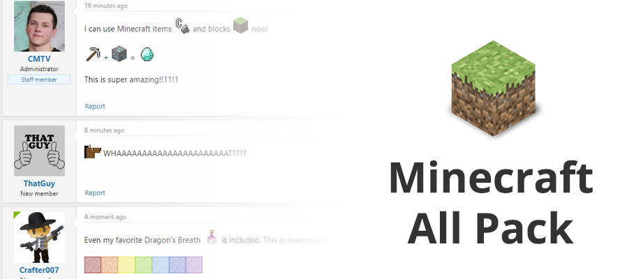
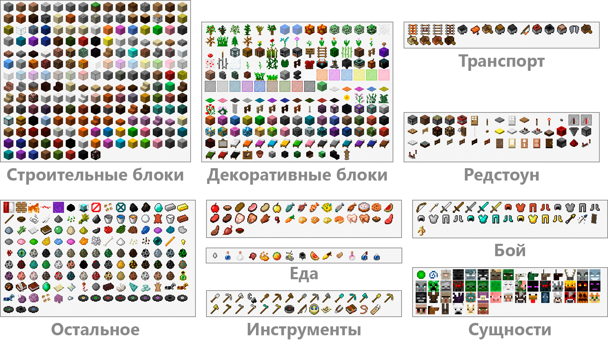

<gallery>
    
    
</gallery>

Для своего [форума](p:mcmodding) по разработке Minecraft модов я создал огромный набор смайликов (более 700), в котором содержались все текстуры блоков, предметов и сущностей из версии 1.12.

Иконки, числовые и текстовые идентификаторы я взял из сайта [Minecraft ID List](https://minecraft-ids.grahamedgecombe.com/).
Для распределения по категориям я создал специальный локальный сайт-инструмент, в котором вручную указывал категорию для каждого смайлика.