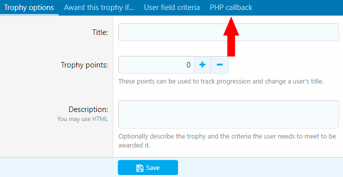
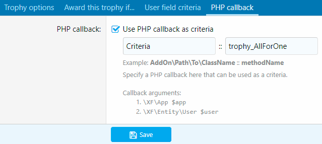

<gallery>
    
    
    
</gallery>

В XenForo для выдачи достижений и повышений используется набор заранее созданных стандартных критериев.
Для простых задач этого хватает, но из-за невозможности добавить свои критерии не получается создавать
уникальные условия для достижений.

Аддон PHP Criteria добавляет к стандартным критериям еще один дополнительный, который задается PHP кодом.
А уже внутри этого кода можно проводить любые проверки, обращаться к базе данных и делать все, что позволяет язык PHP.

Дальнейшее развитие идея о дополнительных критериях получила в гораздо более крутом аддоне [Criteria Builder](p:xf-criteria-builder).