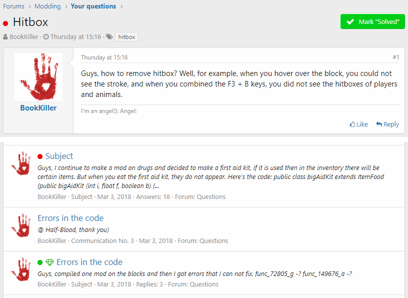
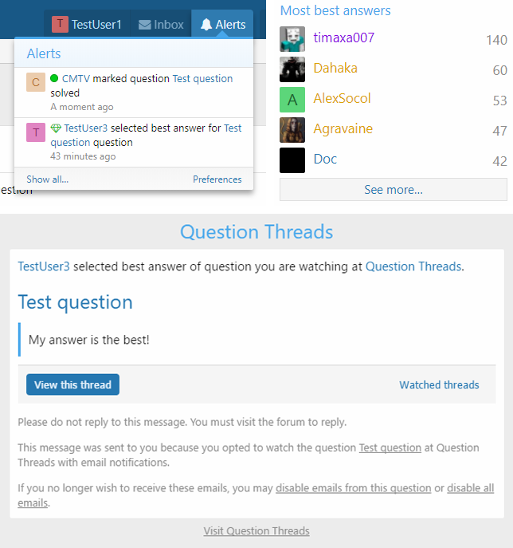
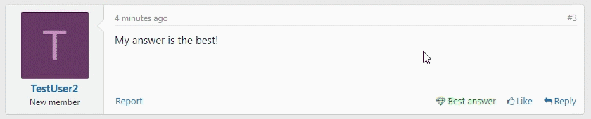

<gallery>
    
    
    
    
    
</gallery>

Форумный движок XenForo идеально подходил для проекта [MC Modding](p:mcmodding). Ему не хватало лишь возможности создавать темы-вопросы и отмечать лучшие ответы. Для решения этой проблемы я и создал Question Threads — свой второй и самый популярный аддон для XenForo, который долгое время висел в топе самых загружаемых аддонов.

Аддон Question Threads позволяет пользователям задавать вопросы на форуме.
Самый полезный ответ можно пометить как "Лучшй ответ".
Статус вопроса и ссылка на лучший ответ отображаются перед названием темы в любом месте на форуме.
Количество лучших ответов отображается в статистике пользователя и может быть использовано для присвоения достижений.

В версии 2.2 у XenForo появилась встроенная вопросно-ответная система, поэтому нужда в моем аддоне пропала.
Я написал конвертер вопросов и лучших ответов из своего аддона во встроенную Q&A-систему XenForo.