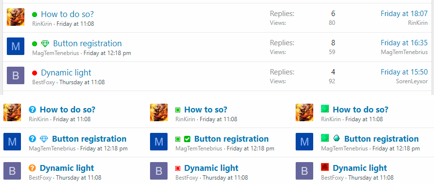

<gallery>
    
    
    
    
    
</gallery>

Форумный движок XenForo идеально подходил для проекта [MC Modding](p:mcmodding). Ему не хватало лишь возможности создавать темы-вопросы и отмечать лучшие ответы. Для решения этой проблемы я и создал Question Threads — свой второй и самый популярный аддон для XenForo, который долгое время висел в топе самых загружаемых аддонов.

В специальных разделах форума пользователи могут создавать вопросные темы. Они отличаются от обычных тем только наличием
свойства "Решено"/"Не решено". Одно из сообщений в такой теме можно пометить как "Лучший ответ". Статус вопроса и ссылка
на лучший ответ отображаются перед названием темы в любом месте на форуме. Количество лучших ответов отображается в статистике пользователя и может быть использовано для присвоения достижений.

В версии 2.2 у XenForo появилась встроенная вопросно-ответная система, поэтому нужда в моем аддоне пропала.
Я написал конвертер вопросов и лучших ответов из своего аддона во встроенную Q&A-систему XenForo.