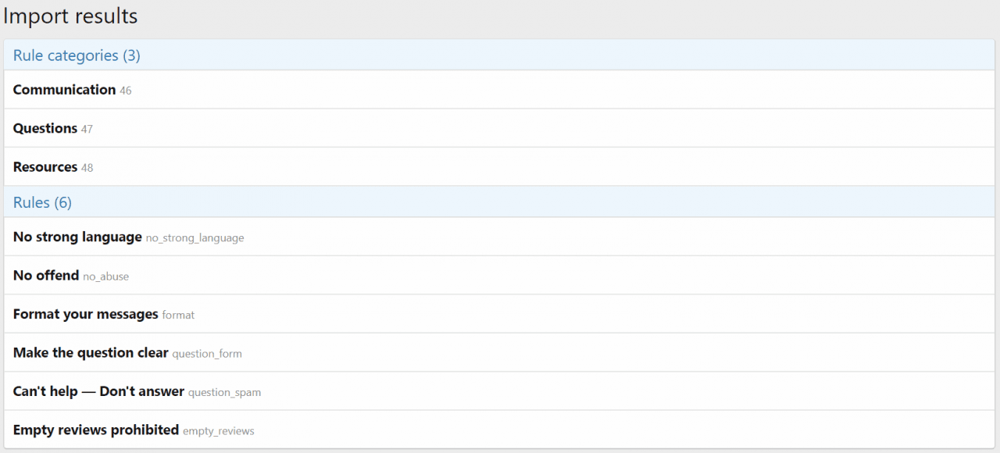

<gallery>
    
    
    
    
</gallery>

Единственный способ добавить правила в XenForo — оформить их текстовым списком на отдельной странице.
Это некрасиво и неудобно.

Для устранения этого недостатка создал аддон, который позволяет создавать правила и группировать их в категории.
Все правила показываются на отдельной, красивой и удобочитаемой странице.
На конкретные правила можно ссылаться с помощью ссылок.

Реализовал систему экспорта/импорта.
Это особенно полезно, когда есть несколько форумов с похожими правилами.