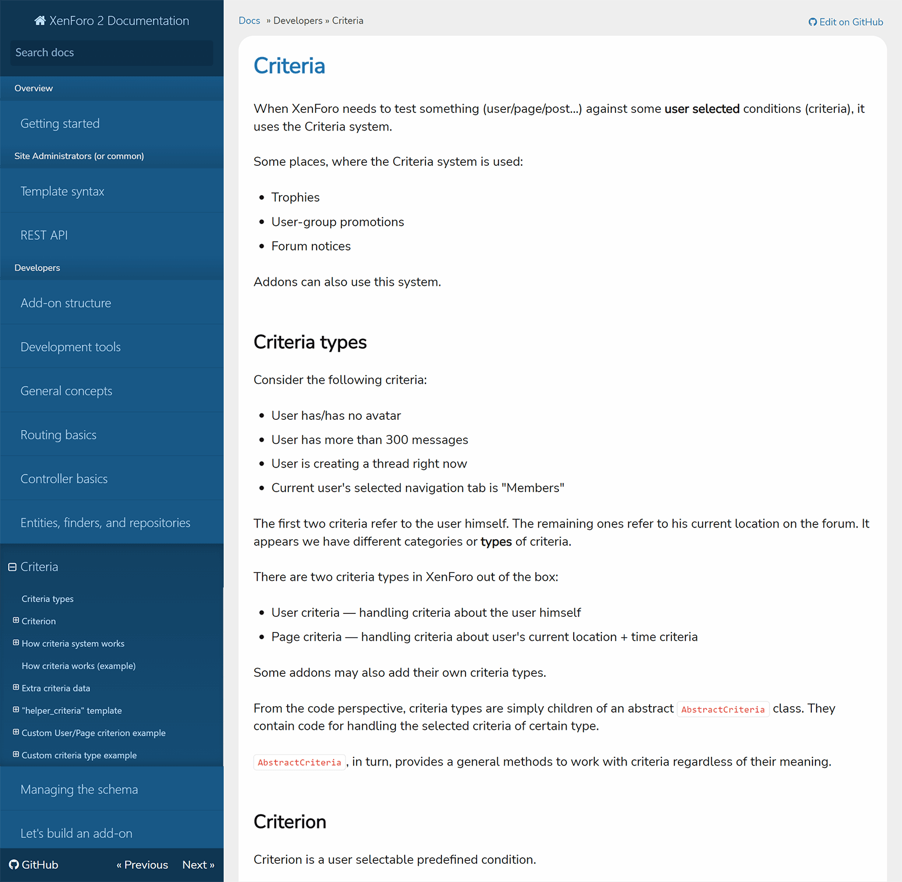
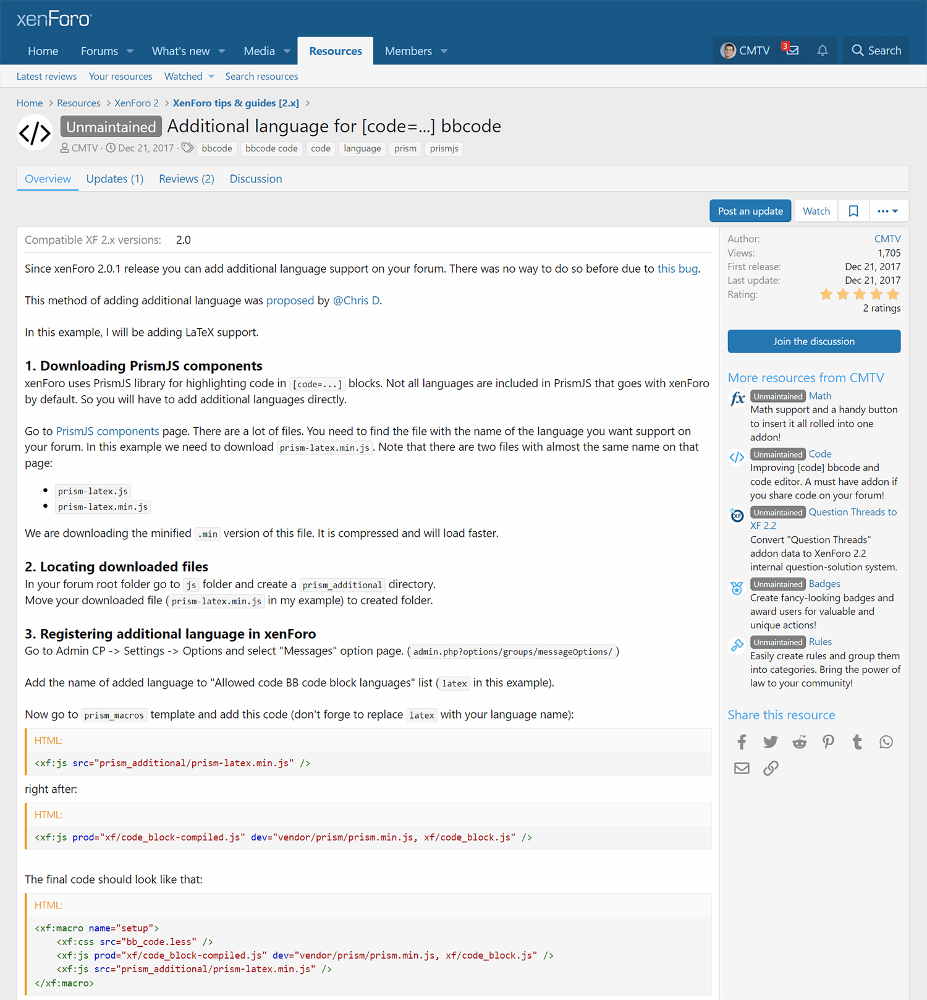
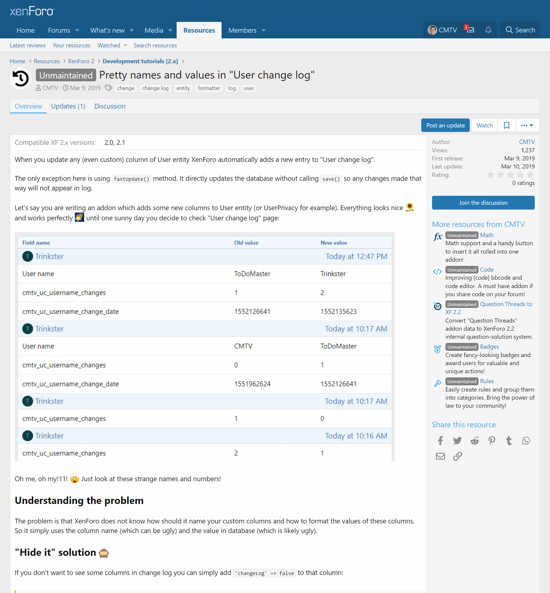

<gallery>
    
    
    
</gallery>

За время увлечения движком XenForo я приобрел очень большой опыт работы с ним, как администратор и как программист.
Этим опытом я регулярно делился: находил баги, подробно отвечал на вопросы, писал уроки и даже снял несколько обучающих видео.

В русскоязычном сообществе я приобрел достаточно большую известность, как разработчик
популярных бесплатных аддонов и помощник. Отметился и на официальном форуме, но
не настолько заметно.

В один момент даже хотел устроиться на работу в команду XenForo, чтобы
писать им понятную и подробную документацию по движку, а заодно работать
своего рода технической поддержкой для разработчиков аддонов. В качестве
тестового задания я написал огромную статью про систему критериев XenForo в
официальной англоязычной документации. От моего предложения разработчики уклонились и ушли в игнор.