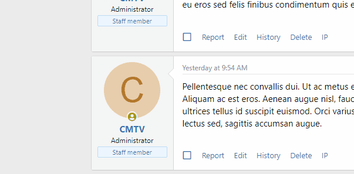
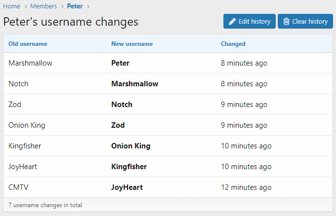
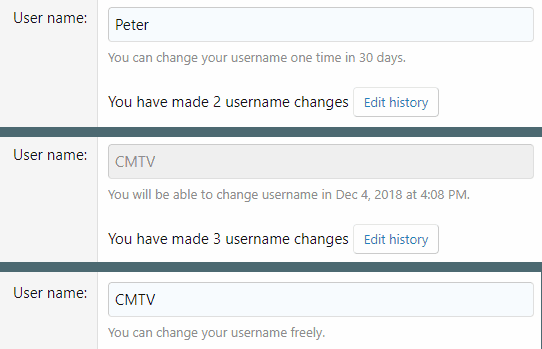
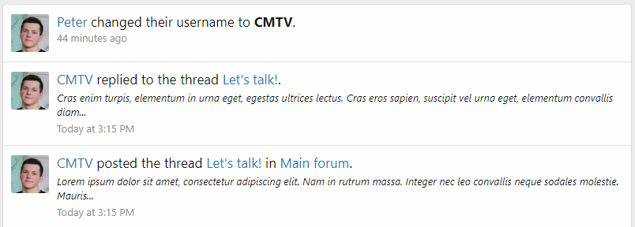
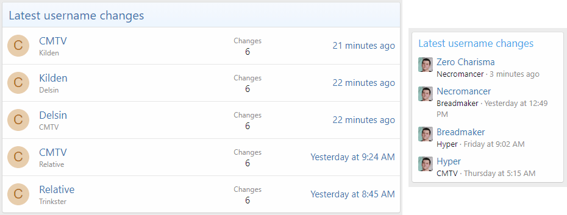
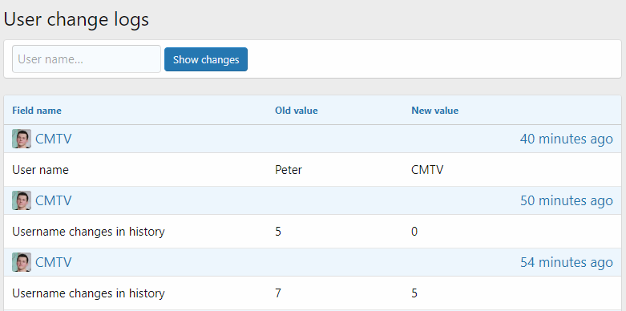

<gallery>
    
    
    
    
    
    
    
</gallery>

Многие сайты и приложения позволяют менять свой никнейм. Был такой аддон и для XenForo, но его функционал меня не особо устраивал, к тому же он был платным. Я решил создать свою версию с нужными мне фишками:

* Красивое окошко недавних никнеймов.
* Отдельная страница с полной историей смена никнеймов.
* Отображение смены ника в блоке активности пользователя.
* Отображение смены никнеймов в админ панели.
* Виджеты последних изменений имен пользователей.
* Возможность использовать число смен имен в качестве критерия.

Аддон получился отличным, о чем говорит большое количество скачиваний.
Ни один аналог не имел такого количества функций.

В версии 2.2 в XenForo реализовали свою систему смены никнеймов.
Этот аддон перестал быть актуальным, прямо как и аддон [Question Threads](p:xf-question-threads).