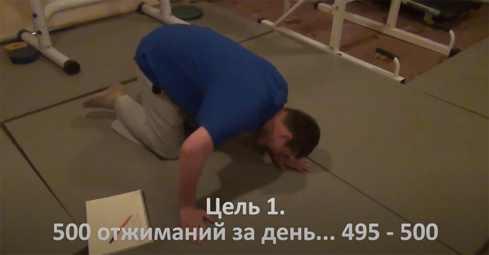
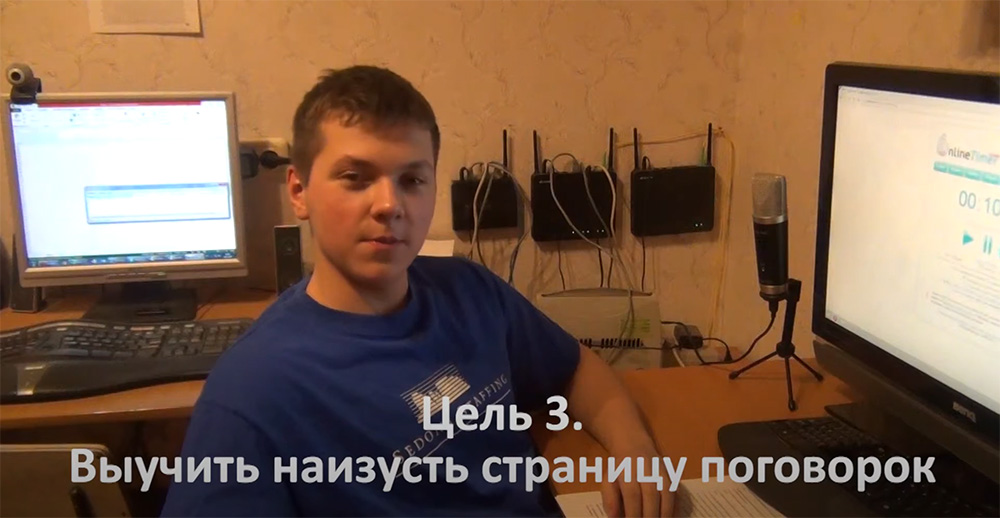
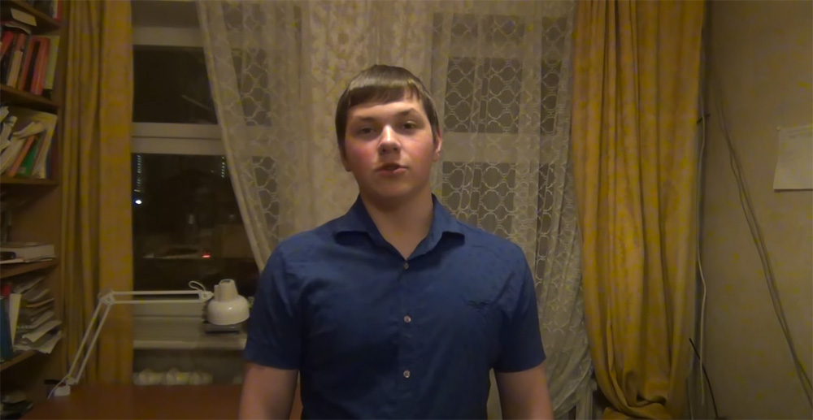

<gallery>
    
    
    
</gallery>

Новый Год — время безумных идей.
Одна из таких безмных идей пришла ко мне с отцом в голову в январе 2015 года.

Суть простая: создать YouTube канал про людей, которые ставят невозможные (для себя) цели на месяц (сезон) и упорно их добиваются.
Каждый день они снимают отчеты, а я их компоную в отдельный ролик.

На первый сезон я поставил себе 3 цели на месяц.
Каждый день я должен был:

* Отжиматься 500 раз.
* Решать страницу примеров в уме.
* Учить по одной строчке сложной скороговорки.

---

Показатели до начала работы:

* Отжимания: 15 (максимум 20)
* Счет в уме: 181 пример за 10 минут
* Трудности при быстром прочтении сложных предложений в слух.

---

Показатели в конце сезона (после 30 дней):

* Отжимания: 50 раз свободно (× 3)
* Счет в уме: 343 примера за 10 минут (× 2)
* "Лигурия" выучена наизусть. Диктия очень сильно улучшилась.