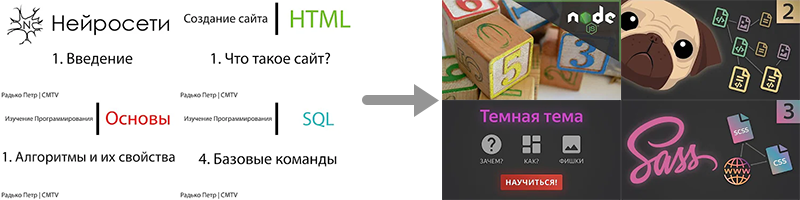
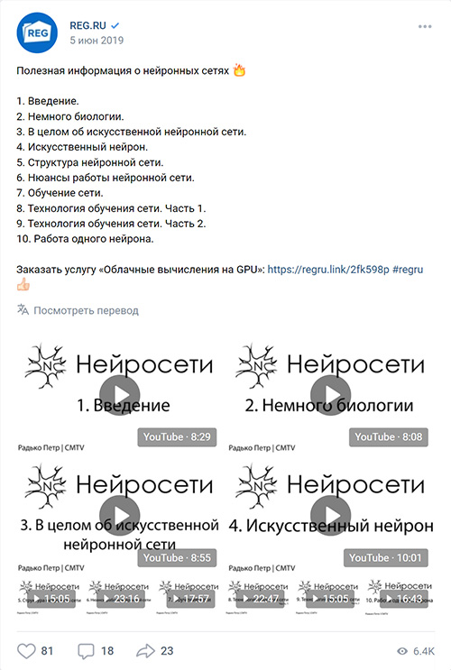

# (Весна 2021) Ребрендинг и новая серия

На канале я отсутствовал рекордных 3 года.
За это время у меня накопился огромный опыт в программировании, математике и множестве других областей.
Мне захотелось им поделиться.

Для начала я провел полный ребрендинг канала. Теперь канал называется "Петр Радько"
и посвящен он не IT-технологиям, а вообще всему, что меня интересует, будь то программирование, математика или даже компьютерные игры.

После ребрендинга я снял серию из 7 роликов по современной верстке сайтов, так как самый большой прогресс у меня был
как раз в сфере разработки статических сайтов, платформы Node.js, препроцессорах HTML, CSS и JS.

## Качество контента

Новый контент разительно отличался по качеству от всех предыдущих моих роликов.

Раньше весь ролик записывался "одним кадром".
Теперь же я записываю множество кусочков по несколько минут и четко представляю что и когда надо говорить.
Вступление вообще зачитываю по заранее заготовленному тексту. Цель — максимально увеличить количество полезной
информации и максимально снизить количество эканий, оговорок и раздумий.

Сильно возросла длительность, что позволило мне раскрывать тему во всех подробностях.
Появились секции с конкретными и полезными примерами использования технологий, про которые я рассказываю.

Перед каждым роликом идет минутное вступление, в котором я кратко поясняю, что ждет зрителей в ролике.
Затем идет короткое интро, причем в каждом ролике играет разная мелодия.

Значительно улучшились также и иконки видео. А ведь именно они играют самую важную роль в том, кликнет зритель на ролик или нет! Убрал ужасный белый фон, добавил больше стилизации... теперь на иконки приятно смотреть, и они наглядно демонстрируют, про что будет ролик, даже если их сильно уменьшить:

Короче говоря, после таких офигительных новых роликов на убогие старые без слез не взглянешь.

## Проблемы

Но не все было прекрасно.

Очень сильно огорчило то, что на протяжении всего времени, что я делал новую серию, количество подписчиков постоянно уменьшалось. Ничего странного тут нет. Им приходило уведомление и они вспоминали, что хотели отписаться от этого чувака, что уже 3 года не ведет канал. Но это все равно очень неприятно. Ты выкладываешься на максимум только ради того, чтобы после загрузки ролика народ и дальше отписывался.

Внезапно оказалось, что на создание качественного ролика уходит много времени. В частности полдня уходит на запись материала, а потом целый день или даже два нужно потратить на монтаж, анимацию вступления, подбор мелодии и прочие штуки.

Совокупность этих двух факторов, а также желание побыстрее закончить третью версию [Демидовича](p:dodem) привели к тому, что я вновь забросил канал...

# Ранние времена

<gallery>
    
</gallery>

## Создание модов для Minecraft

Именно с этой темы я начал вести канал и именно из-за этих роликов получил стартовую популярность.
Дети (в том числе и я) любили Minecraft и хотели добавлять в него свои блоки и предметы. Я показывал им, как это делать.

Версии Minecraft сменяли друг друга и я регулярно переснимал свои обучающие ролики.
В итоге все это вылилось в создание крупнейшего русскоязычного [сообщества](p:mcmodding) создателей Minecraft модов.

## Нейронные сети

Самая популярная серия роликов на канале. Записана под впечатлением от первой частично прочитанной по этой теме книге Рышарда Тадеусевича "Элементарное введение в технологию нейронных сетей". В совокупности 10 роликов имеют более 400 000 просмотров.

Личная заинтересованность в теме, а также такой большой отклик от зрителей в итоге побудили меня создать
отдельный [портал](p:neuralnet-info) про искусственные нейронные сети.

Один из самых крупных регистраторов доменов [REG.RU](https://www.reg.ru/) [порекомендовал](https://vk.com/wall-16725543_38232) эту серию роликов в своих группах в социальных сетях ВКонтакте, Одноклассники и Facebook.