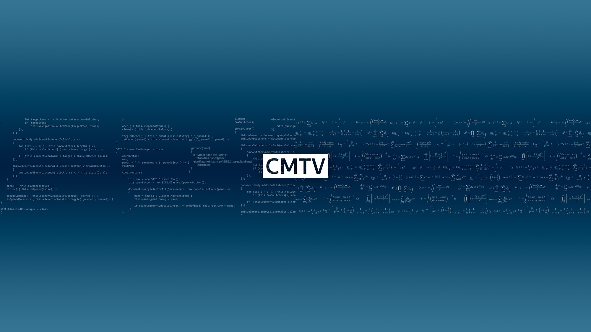
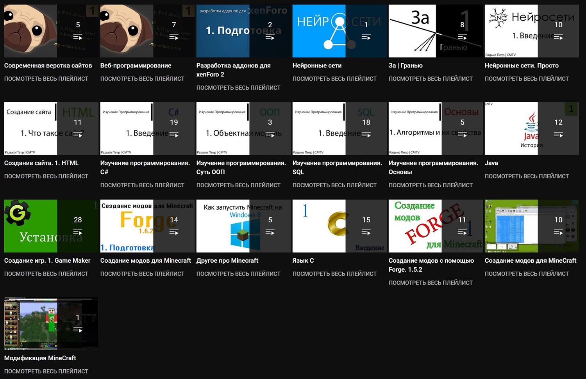

<gallery>
    
    
</gallery>

Мой самый первый, самый успешный и самый старый YouTube канал.
Основная (но не единственная) тематика канала — образовательные ролики по программированию и математике.
Я много раз бросал вести канал, но раз за разом возвращался, выводя контент на новый уровень качества.

Логика простая: если я нашел что-то полезное и интересное, я просто и понятно объясняю это в своих роликах.
За все время снял десятки обучающих курсов по созданию модов для Minecraft, популярным языкам программирования, созданию сайтов и даже по нейронным сетям.

Название канала, "CMTV", расшифровывается как "Computer Master TV".
Это предложение неплохо описывает мою деятельность. Я хорошо разбираюсь в компьютерах, а также люблю обучать других.
Со временем, эта аббревиатура стала моим псевдонимом в интернете.