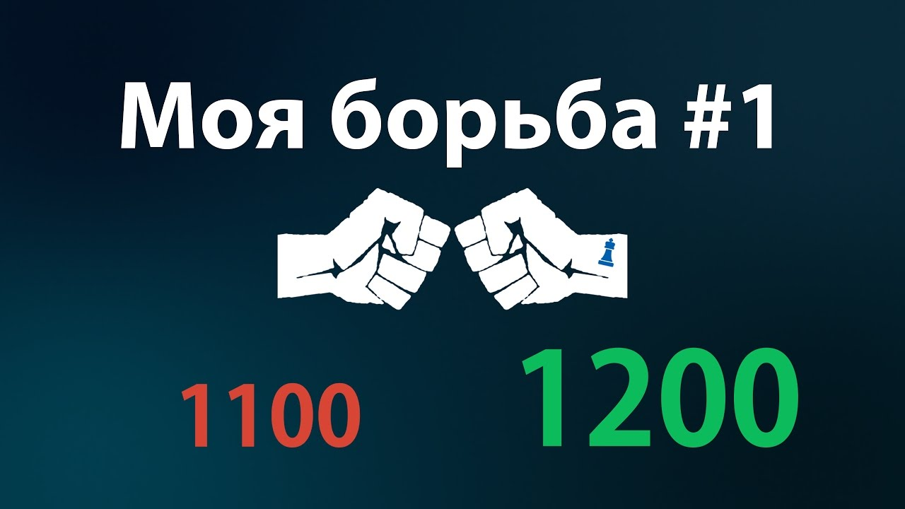
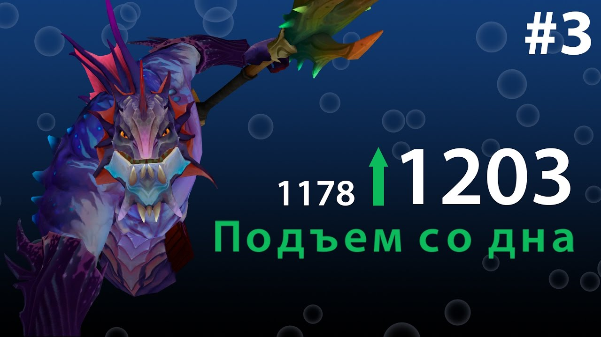
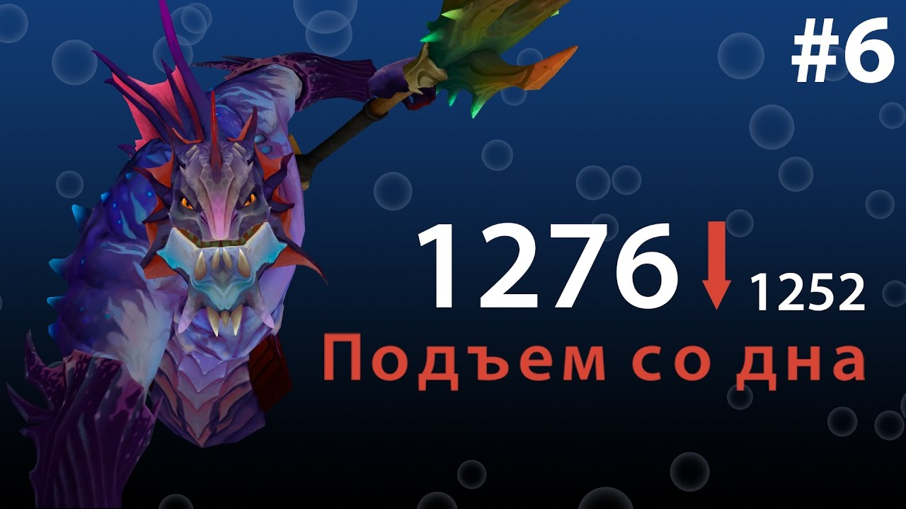

<gallery>
    
    
    
</gallery>

Откалибровался в Dota 2 на 1100 MMR. Это очень низкий уровень.
Решил поднимать свой рейтинг и выкладывать сыгранные игры на отдельный YouTube канал.
Записи игр размещались в рубрике "Подъем со дна".
После каждой сотни поднятого MMR в рубрике "Моя борьба" выпускал ролик с разбором ошибок и смешными моментами.

Планировал еще делать серию "Mad Monkey King" с нарезкой хайлайтов на Monkey King, которого на момент создания канала добавили в игру.

Проект примечателен тем, что для него я за 4 дня сделал одно из самых крутых интро в своей жизни.
Кроме того, я впервые создал сложный с монтажной точки зрения ролик с красивыми переходами и нарезками крутых моментов.
Результатом очень доволен.

Потенциал у проекта был, но у меня просто не хватало сил после записи материала проводить долгую и серьзеную работу по его отсмотру, выявлению проблем и извлечению уроков. В результате, я начал записывать материал наперед, а потом и вовсе забил на его анализ.