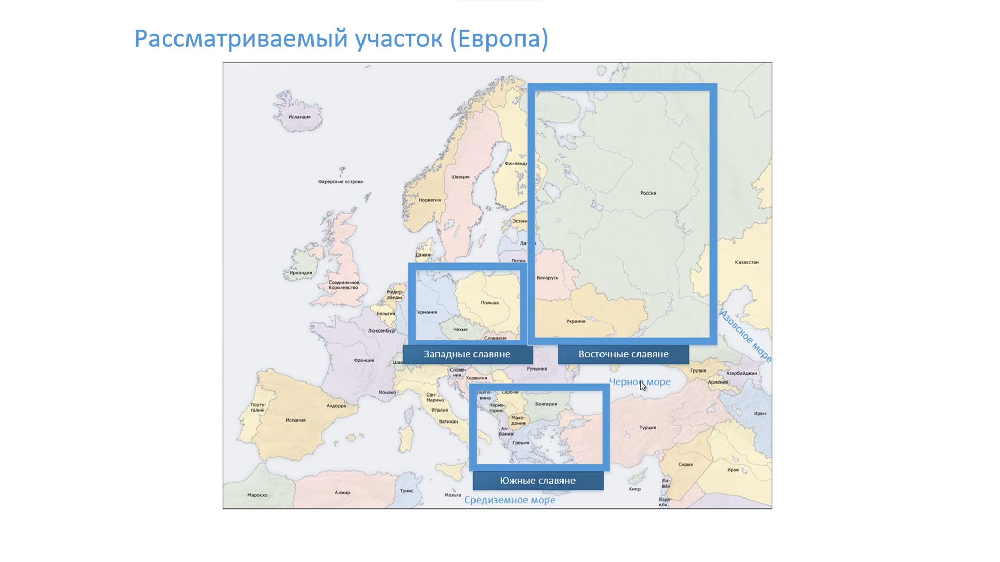
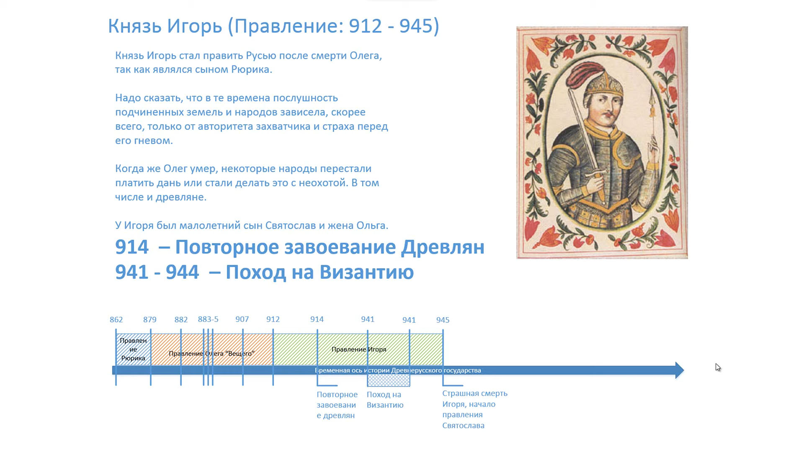
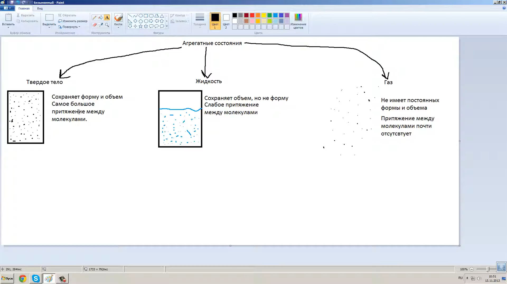

<gallery>
    
    
    
</gallery>

С пятого класса учился на дому, поэтому приходилось самостоятельно искать и структурировать информацию.
В процессе изучения возникало сильное желание поделиться выученным.

В 10 классе понял, что это желание можно реализовать в виде роликов.
Чтобы не мелочится, решил создать образовательный канал самой широкой тематики: школьные предметы, программирование, разработка игр и все остальное.

Естественно, тему я выбрал слишком широкую и объем работ не потянул.
Удалось лишь снять неполные курсы по обществознанию, физике, общей истории и истории Древней Руси.

<youtube video="JM4uaNjNt1A">