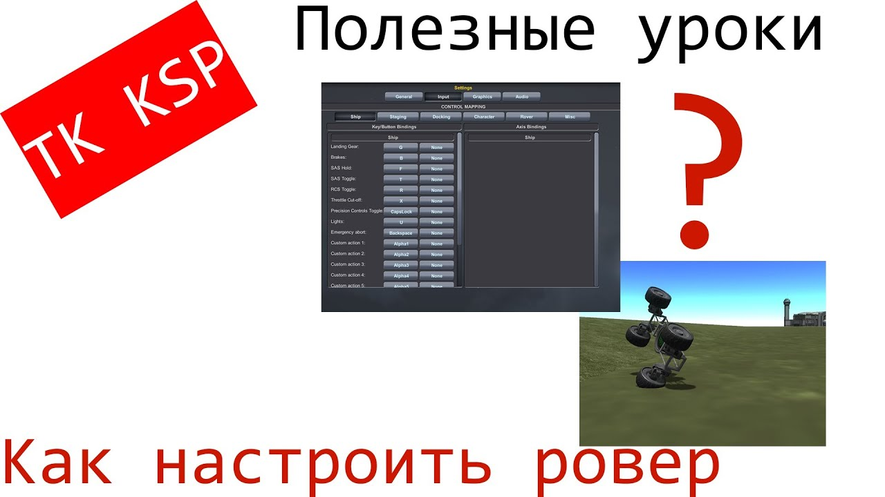
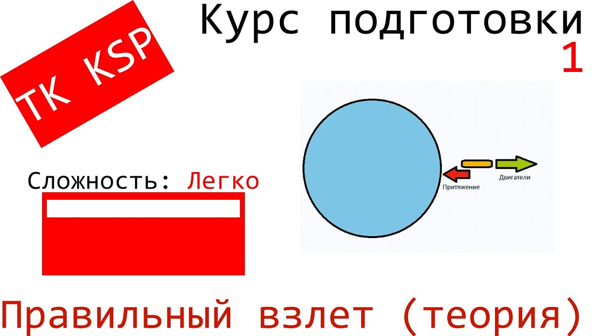
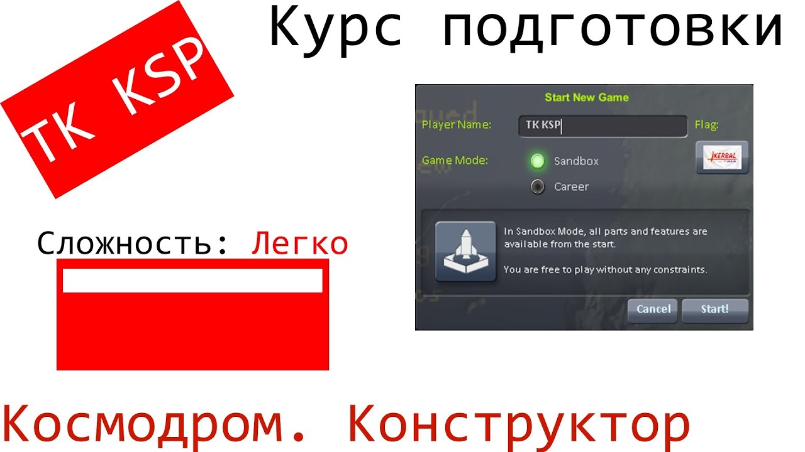
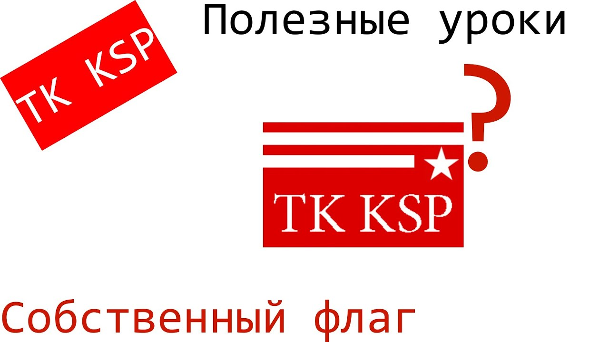
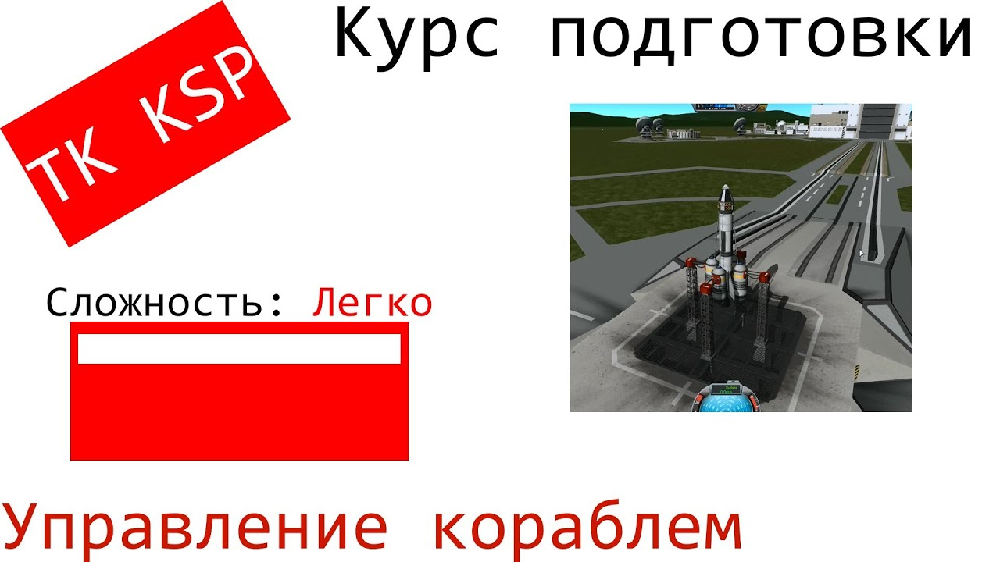

<gallery>
    
    
    
    
    
</gallery>

Одно время очень увлекся симулятором космической программы Kerbal Space Program: можно строить корабли, запускать их в космос, строить космические станции, посещать планеты и так далее.

Игра сложная и требует от игрока хорошего понимания базовых принципов космических полетов.
Например, меня поразило, что для выхода на орбиту, нужно лететь не только вверх, но еще и набирать горизонтальную скорость.

Мне захотелось поделиться этими необычными вещами про космос, поэтому я решил создать обучающий канал по этой игре. И тема увлекательная, и игра интересная.